# Instance



Once your provider is initialized, you can connect an existing account.

You need:

- the address of the account
- the private key of this account

```typescript
import { Account, RpcProvider } from 'starknet';
```

## Connect to a pre-deployed account (Starknet Devnet)

When you launch `starknet-devnet`, 10 accounts are pre-deployed with 100 dummy ETH and STRK in each.

:::info
Devnet predeployed accounts will change at each run. To freeze them, launch with: `cargo run --release -- --seed 0` or use docker image -seed0
:::

Addresses and private keys are displayed on the console at initialization.

```text
| Account address |  0x064b48806902a367c8598f4f95c305e8c1a1acba5f082d294a43793113115691

| Private key     |  0x0000000000000000000000000000000071d7bb07b9a64f6f78ac4c816aff4da9

| Public key      |  0x039d9e6ce352ad4530a0ef5d5a18fd3303c3606a7fa6ac5b620020ad681cc33b
```

Then you can use this code:

```typescript
// initialize provider for Devnet
const myProvider = new RpcProvider({ nodeUrl: 'http://127.0.0.1:5050/rpc' });
// initialize existing account 0 pre-deployed on Devnet
const accountAddress = '0x064b48806902a367c8598f4f95c305e8c1a1acba5f082d294a43793113115691';
const privateKey = '0x0000000000000000000000000000000071d7bb07b9a64f6f78ac4c816aff4da9';

const myAccount = new Account({
  provider: myProvider,
  address: accountAddress,
  signer: privateKey,
});
```

Your account is now ready to be used.

## 👛 Connect to an existing account (Network)

The code is the same, you just have to:

- connect to the appropriate network.
- use the address of this account (public data).
- use the private key of this account (very sensitive data: your code MUST not disclose it).

For example, to connect an existing account on testnet, with a private key stored in a .env non-archived file:

```typescript
// initialize RPC v0.9 provider
const myProvider = new RpcProvider({ nodeUrl: `${myNodeUrl}` });
// initialize existing account
const privateKey = process.env.OZ_NEW_ACCOUNT_PRIVATE_KEY;
const accountAddress = '0x051158d244c7636dde39ec822873b29e6c9a758c6a9812d005b6287564908667';

const myAccount = new Account({
  provider: myProvider,
  address: accountAddress,
  signer: privateKey,
});
```

:::info
**v8 Note**: Only V3 transactions are supported in Starknet.js v8. V2 transactions have been removed with Starknet 0.14.
All accounts now use V3 transactions with Starknet fees by default.
:::

### Advanced Account Configuration (v8)

Starknet.js v8 introduces additional configuration options for accounts:

```typescript
const myAccount = new Account({
  provider: myProvider,
  address: accountAddress,
  signer: privateKey,
  cairoVersion: '1', // optional - Cairo version ('1' is default)
  transactionVersion: ETransactionVersion.V3, // ETransactionVersion.V3 is the default and only option
  paymaster: undefined, // optional - paymaster for sponsored transactions
  deployer: defaultDeployer, // optional - custom deployer (defaultDeployer or legacyDeployer)
  defaultTipType: 'recommendedTip', // optional - tip strategy for transactions
});
```

### New Parameters Explained

- **`paymaster`**: Configure a paymaster for sponsored transactions (see [Paymaster guide](./paymaster.md))
- **`deployer`**: Choose between `defaultDeployer` (UDC V2) or `legacyDeployer` (UDC V1)
- **`defaultTipType`**: Default tip calculation strategy - options include:
  - `'minTip'`, `'maxTip'`, `'averageTip'`, `'medianTip'`, `'modeTip'`
  - `'recommendedTip'` (default), `'p90Tip'`, `'p95Tip'`

## Connect to an account that uses Ethereum signature

Accounts that use Ethereum signatures are possible because of account abstraction.

To connect to this type of account:

```typescript
const myEthPrivateKey = '0x525bc68475c0955fae83869beec0996114d4bb27b28b781ed2a20ef23121b8de';
const myEthAccountAddressInStarknet =
  '0x65a822fbee1ae79e898688b5a4282dc79e0042cbed12f6169937fddb4c26641';
const myEthSigner = new EthSigner(myEthPrivateKey);
const myEthAccount = new Account({
  provider: myProvider,
  address: myEthAccountAddressInStarknet,
  signer: myEthSigner,
});
```
