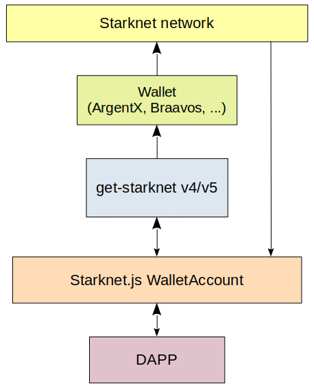
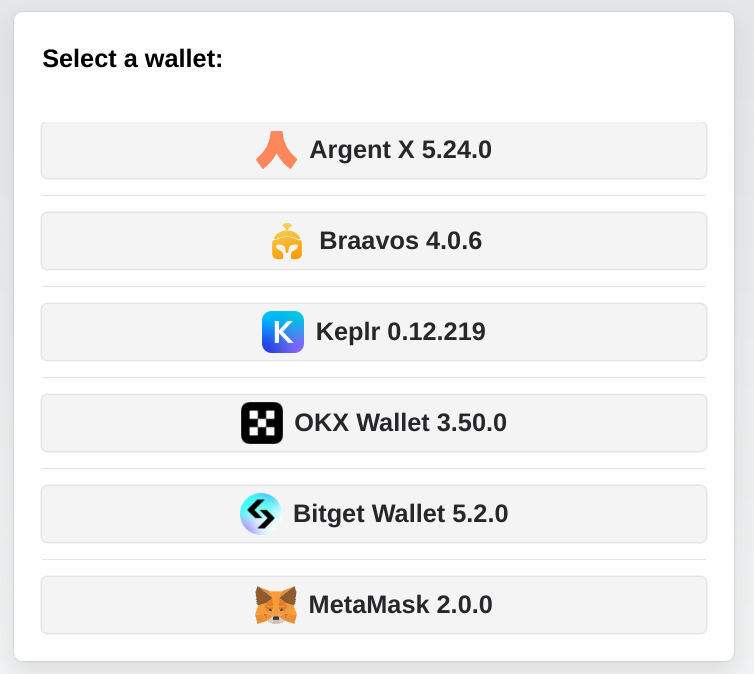
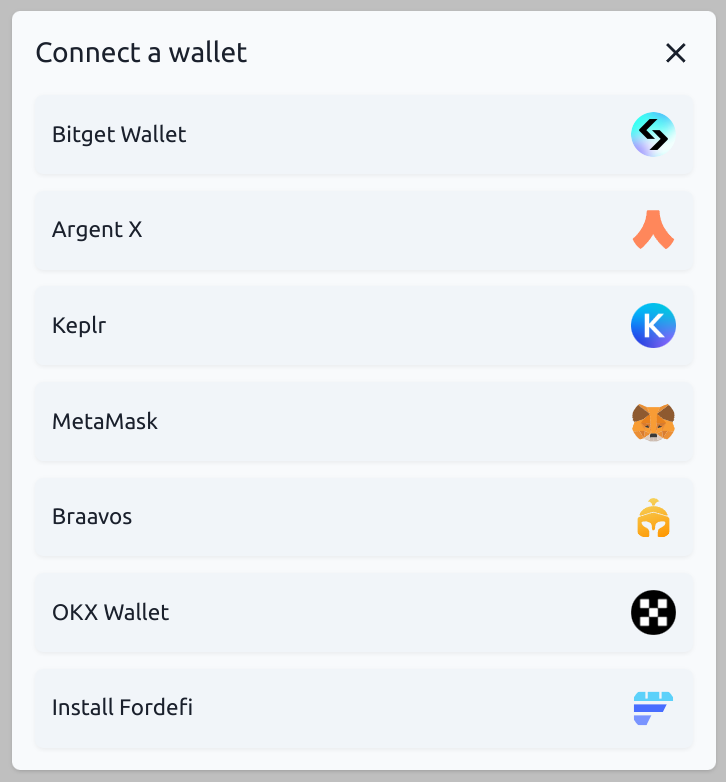
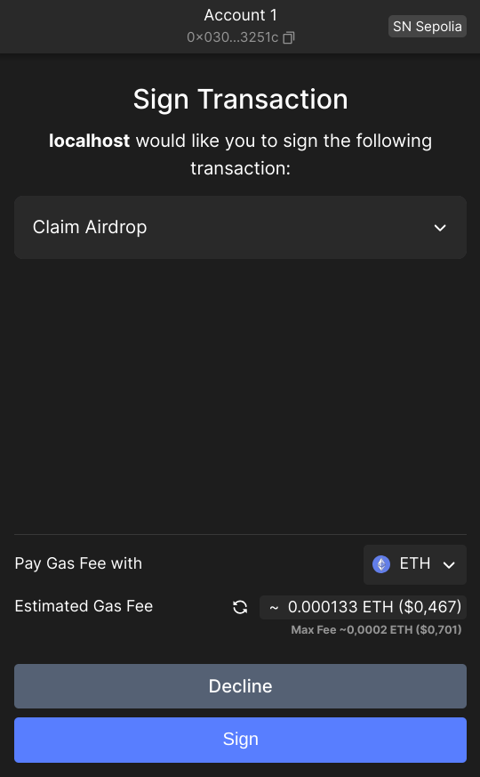
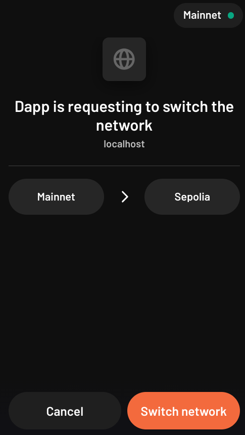
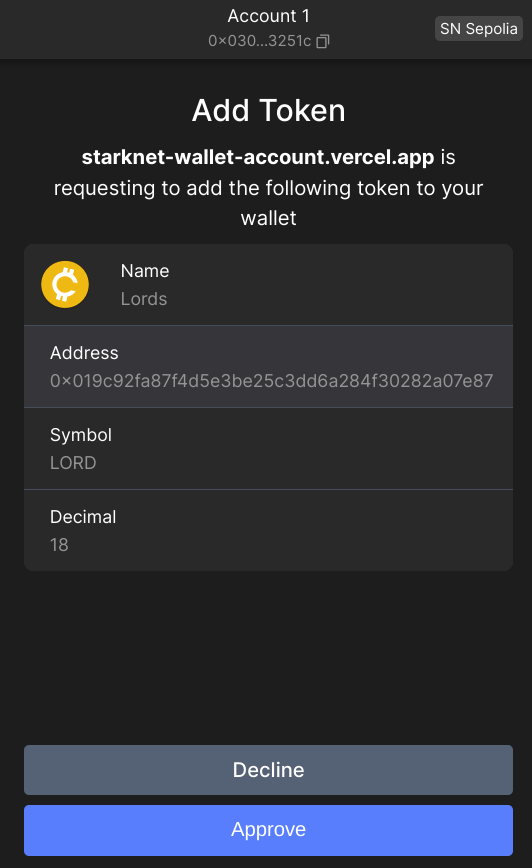

# WalletAccount

**Use wallets to sign transactions in your DAPP.**

The [`WalletAccount`](../../API/classes/WalletAccount) class is similar to the regular [`Account`](../../API/classes/Account) class, with the added ability to ask a browser wallet to sign and send transactions. Some other cool functionalities will be detailed hereunder.

The private key of a `WalletAccount` is held in the Wallet, so any signature is managed by the wallet. With this approach DAPPs don't need to manage the security for any private key.

:::caution
This class functions only within the scope of a DAPP. It can't be used in a Node.js script.
:::

## Architecture

In your DAPP, you have to use the `get-starknet` library to select and interact with a wallet.



When retrieving information from Starknet, a `WalletAccount` instance will read directly from the blockchain. That is why at the initialization of a `WalletAccount` a provider is a required parameter — either [`ProviderOptions`](../../API/interfaces/ProviderOptions.md) (e.g. `{ nodeUrl }`) or a [`ProviderInterface`](../../API/classes/ProviderInterface.md) instance such as [`RpcProvider`](../../API/classes/RpcProvider.md). It will be used for all reading activities.

## With get-starknet v5

When retrieving information from Starknet, a `WalletAccountV5` instance will read directly from the blockchain. That is why at the initialization of a `WalletAccountV5` a provider is a required parameter — either [`ProviderOptions`](../../API/interfaces/ProviderOptions.md) (e.g. `{ nodeUrl }`) or a [`ProviderInterface`](../../API/classes/ProviderInterface.md) instance such as [`RpcProvider`](../../API/classes/RpcProvider.md). It will be used for all reading activities.

If you want to write to Starknet the `WalletAccountV5` will ask the wallet to sign and send the transaction using the Starknet Wallet API to communicate.

As several wallets can be installed in your desktop/mobile, the `WalletAccountV5` needs the ID of one of the available wallets. You can ask `get-starknet v5` to provide a list of available wallets, and you have to select one of them, called a `WalletWithStarknetFeatures` Object.

### Select a Wallet

Using the `get-starknet/discovery v5` library you have to create your own UI and logic to select one of the available wallets. An example in a DAPP: [**here**](<https://github.com/PhilippeR26/Cairo1JS/blob/getStarknetv5/src/app/(site)/components/client/ConnectWallet/SelectWallet.tsx>). In this example you can select only the wallets compatible with the Starknet Wallet API.  


Instantiating a new `WalletAccountV5`:

```typescript
import { createStore, type Store } from '@starknet-io/get-starknet/discovery'; // v5.0.0 min
import { type WalletWithStarknetFeatures } from '@starknet-io/get-starknet/standard/features';
import { WalletAccountV5, walletV5 } from 'starknet'; // v7.2.0 min
const myFrontendProviderUrl = 'https://free-rpc.nethermind.io/sepolia-juno/v0_8';
const store: Store = createStore();
const walletsList: WalletWithStarknetFeatures[] = store.getWallets();
// Create you own Component to select one of these wallets.
// Hereunder, selection of 2nd wallet of the list.
const selectedWallet: WalletWithStarknetFeatures = walletsList[1];
const myWalletAccount: WalletAccountV5 = await WalletAccountV5.connect(
  { nodeUrl: myFrontendProviderUrl },
  selectedWallet
);
```

The wallet is connected to this blockchain to write in Starknet:

```typescript
const writeChainId = await walletV5.requestChainId(myWalletAccount.walletProvider);
```

and to this blockchain to read Starknet:

```typescript
const readChainId = await myWalletAccount.getChainId();
```

### Subscription to events

You can subscribe to one event with `get-starknet v5`:

`onChange`: Triggered each time you change the current account or the current network in the wallet.

```typescript
import type { StandardEventsChangeProperties } from "@wallet-standard/features";
const addEvent = useCallback((change: StandardEventsChangeProperties) => {
    console.log("Event detected", change.accounts);
    if (change.accounts?.length) {
        console.log("account event=", change.accounts[0].address);
        setCurrentAccount(change.accounts[0].address);
        console.log("network event=", change.accounts[0].chains[0]);
        setCurrentChainId(change.accounts[0].chains[0].slice(9));
    }
}, []);
...
useEffect(() => {
    console.log("Subscribe events...");
    selectedWalletAccountV5?.onChange(addEvent);
    return () => {
        console.log("Unsubscribe to events...");
        selectedWalletAccountV5?.unsubscribeChange();
}
}
, [selectedWalletAccountV5, addEvent]);
```

## With get-starknet v6

`WalletAccountV6` extends `WalletAccountV5` with support for the **STRK20 privacy protocol** — a privacy layer for token operations using zero-knowledge proofs.

When retrieving information from Starknet, a `WalletAccountV6` instance reads directly from the blockchain via its provider. If you want to write to Starknet, `WalletAccountV6` asks the wallet to sign and send the transaction using the Starknet Wallet API v6.

:::note
`WalletAccountV6` requires `get-starknet v6` (v6.0.2 min).
:::

### Select a Wallet

The wallet selection follows the same pattern as v5:

```typescript
import { createStore, type Store } from '@starknet-io/get-starknet/discovery'; // v6.0.2 min
import { type WalletWithStarknetFeatures } from '@starknet-io/get-starknet-wallet-standard/features'; // v6
import { WalletAccountV6, walletV6 } from 'starknet';

const myFrontendProviderUrl = 'https://free-rpc.nethermind.io/sepolia-juno/v0_10';
const store: Store = createStore();
const walletsList: WalletWithStarknetFeatures[] = store.getWallets();
// Create your own component to select one of these wallets.
// Hereunder, selection of 2nd wallet of the list.
const selectedWallet: WalletWithStarknetFeatures = walletsList[1];
const myWalletAccount: WalletAccountV6 = await WalletAccountV6.connect(
  { nodeUrl: myFrontendProviderUrl },
  selectedWallet
);
```

### STRK20 privacy protocol

STRK20 is a **note-based privacy pool** for ERC-20 assets: a single pool contract holds the deposited tokens, but inside the pool funds are encrypted **notes**, so observers can't tell who owns what. Every state change is backed by a zero-knowledge proof verified on-chain. The mental model is: **deposit (shield) → transact privately inside the pool → withdraw (unshield)**. The wallet holds the private state and generates the proof; your DAPP only _describes the actions_ it wants.

:::info
As of 2026-08, the **Ready** and **Xverse** wallets support the STRK20 wallet API.
:::



Reading the diagram: a **solid arrow** is an action your DAPP declares in its `STRK20_ACTION[]`; a **dotted arrow** is infrastructure work the pool and the wallet do for you, and the green box is infrastructure driven by the pool: only the pool can make it execute anything, though your DAPP may freely query its read-only views (see [Address of a shadow account](#address-of-a-shadow-account)). **Purple** boxes are shielded — observers see that the pool changed state, not who owns what. **Grey** boxes are ordinary public on-chain activity: a shadow account holds **public** ERC-20 funds, and its privacy comes solely from the fact that its address cannot be linked back to you. The open note is the in-between case: it lives in the pool, but filling it publishes the amount it received.

`WalletAccountV6` exposes four dedicated methods for these operations, plus `executeWithProof()`.

#### STRK20 actions

A DAPP describes what it wants with an array of `STRK20_ACTION`. There are exactly five action types:

| Action                | `type`                    | Fields                                            | Effect                                                           |
| --------------------- | ------------------------- | ------------------------------------------------- | ---------------------------------------------------------------- |
| Deposit               | `"deposit"`               | `token`, `amount`                                 | Public funds → pool (always to self).                            |
| Withdraw              | `"withdraw"`              | `token`, `amount`, `recipient`                    | Pool → public `recipient` address.                               |
| Transfer              | `"transfer"`              | `token`, `amount` (FELT or `"OPEN"`), `recipient` | Private transfer inside the pool to another registered user.     |
| Invoke                | `"invoke"`                | `contract`, `calldata`                            | Calls an invoke helper contract, executed by the pool.           |
| Shadow account invoke | `"shadow_account_invoke"` | `dapp_name`, `nonce`, `calls`, `collect_policy`   | Calls contracts through the user's shadow account for this DAPP. |

`amount` is always expressed in the token's smallest unit.

:::note About `amount: "OPEN"`
`"OPEN"` is only meaningful inside a **multi-action transaction**. It creates an empty _open note_ whose value is unknown at build time (e.g. the output of an AMM swap) and is filled later in the **same transaction** by a paired `invoke` or `shadow_account_invoke` action. It is never used on its own.
:::

A simple deposit, for example:

```typescript
import type { STRK20_ACTION } from 'starknet';

const actions: STRK20_ACTION[] = [
  {
    type: 'deposit',
    token: '0x04718f5a0fc34cc1af16a1cdee98ffb20c31f5cd61d6ab07201858f4287c938d', // STRK
    amount: '0xde0b6b3a7640000', // 1e18, smallest unit
  },
];
```

#### The invoke helper

An `invoke` action does **not** call a protocol directly. Its `contract` field points at an **invoke helper**: a small dedicated contract, written and audited for one single operation of one protocol (an Ekubo swap, a Vesu deposit…). The pool sends the input to the helper, calls it, and collects the proceeds — all inside the same transaction.

A helper follows a fixed convention: it exposes a `privacy_invoke` entry point, the **last felt of its calldata is always the id of the open note to fill**, and it measures its own output as a balance delta before handing it back to the pool. It holds nothing between transactions, and it is shared by every user — so the protocol always sees the same caller address, whoever you are. That is exactly what makes this path anonymous.

Since your DAPP knows neither the pool address nor the id of the open note when it builds the action, the calldata accepts **placeholders**, which the wallet substitutes while assembling the actions:

| Placeholder         | Substituted with                                                                                            |
| ------------------- | ----------------------------------------------------------------------------------------------------------- |
| `${poolAddress}`    | The privacy pool contract address — which is also the caller the helper sees.                               |
| `${openNoteIds[N]}` | The id of the Nth open note of the transaction, i.e. the Nth `transfer` with `amount: "OPEN"` (zero-based). |

A calldata item is therefore a `STRK20_CALLDATA_ITEM`, that is a felt **or** a `STRK20_CALLDATA_PLACEHOLDER`. Pass placeholders as raw strings, exactly as written above: do not compile or normalize them, or the wallet will not recognize them.

The classic three-action shape — fund the helper, create the note that will receive the output, run the operation:

```typescript
const actions: STRK20_ACTION[] = [
  // 1. Send the input token from the shielded balance to the helper:
  { type: 'withdraw', token: strkAddress, amount: '0x2386f26fc10000', recipient: helperAddress },
  // 2. Create the open note that will receive the output token:
  { type: 'transfer', token: usdcAddress, amount: 'OPEN', recipient: myAddress },
  // 3. Run the operation:
  {
    type: 'invoke',
    contract: helperAddress,
    calldata: [usdcAddress, minAmountOut, '${poolAddress}', '${openNoteIds[0]}'],
  },
];
```

:::caution
The number of open notes **created** by `transfer` actions must match the number **filled** by the invoke. Otherwise the wallet rejects the request with `INVALID_REQUEST_PAYLOAD`, before generating any proof.
:::

#### Helper or shadow account?

Both run calls on your behalf without revealing who you are, but they are not interchangeable:

|                             | `invoke` (helper)                                                | `shadow_account_invoke` (shadow account)                              |
| --------------------------- | ---------------------------------------------------------------- | --------------------------------------------------------------------- |
| Contract                    | One dedicated helper per operation, someone has to write it      | Generic infrastructure, nothing to write                              |
| Caller seen by the protocol | The shared helper address, identical for every user              | Your own stable pseudonymous address                                  |
| State                       | None: input consumed and output returned in the same transaction | A public balance that persists across transactions                    |
| Payload                     | Raw felts and placeholders, following the helper ABI             | Structured `calls`, any contract and entrypoint                       |
| Best suited to              | Atomic operations: swap, lending round-trip                      | Positions held over time, rewards, DAPPs recognizing a returning user |

A transaction has a single invoke slot, so the two are **mutually exclusive**: one or the other, never both.

#### Get STRK20 balances

```typescript
import type { STRK20_BALANCE_ENTRY } from 'starknet';

const balances: STRK20_BALANCE_ENTRY[] = await myWalletAccount.strk20Balances([
  '0x04718f5a0fc34cc1af16a1cdee98ffb20c31f5cd61d6ab07201858f4287c938d', // STRK token address
]);
console.log('balance =', balances[0].balance);
```

#### Submitting a STRK20 transaction

Three methods, but one of them is the answer almost every time. They differ only on **who submits the transaction, and therefore who pays the fee**:

| Method                             | Submits and pays                              | Use it                                                         |
| ---------------------------------- | --------------------------------------------- | -------------------------------------------------------------- |
| `strk20InvokeTransaction(actions)` | The wallet — it adds the fee action by itself | **Almost always.**                                             |
| `strk20PrepareInvoke(actions)`     | Your DAPP — the wallet adds no fee action     | To sponsor the fee for your user, or to estimate it beforehand |
| `executeWithProof(call, proof)`    | The wallet                                    | To submit a prepared call through the wallet after all         |

**The default.** One call, and the wallet does everything: approval UI, proof, fee, submission.

```typescript
const result = await myWalletAccount.strk20InvokeTransaction(actions);
console.log('transaction hash =', result.transaction_hash);
```

:::note
Generating the ZK proof makes this call **much slower** than an ordinary invoke, and the user has to approve it. Tell them in your UI, or your DAPP will look frozen.
:::

**Sponsoring the fee.** `strk20PrepareInvoke()` builds the call and its proof without submitting anything, and without adding a fee action — whoever submits pays. Your DAPP submits it with an account of its own, and the user pays nothing:

```typescript
import type { STRK20_CALL_AND_PROOF } from 'starknet';

const { call, proof }: STRK20_CALL_AND_PROOF = await myWalletAccount.strk20PrepareInvoke(actions);
// `call` is a standard Starknet.js `Call`, submittable by any account:
const result = await mySponsorAccount.execute(call, {
  proof: proof.data,
  proofFacts: proof.proof_facts,
});

// ...or hand it back to the wallet instead of paying yourself:
const resp = await myWalletAccount.executeWithProof(call, proof);
```

**Estimating first.** With `simulate: true` the wallet skips the expensive proof generation and returns the same call with an empty proof — enough to estimate the fee or preview the operation, but **not submittable**:

```typescript
const simulated = await myWalletAccount.strk20PrepareInvoke(actions, true);
const fee = await mySponsorAccount.estimateInvokeFee(simulated.call);
```

#### STRK20 shadow accounts

A **shadow account** is a persistent, pseudonymous identity that a user owns for one specific DAPP. It is derived from (user, `dapp_name`, `nonce`), deployed lazily at a deterministic address on first use, and driven exclusively through the pool. Each `nonce` gives the user a distinct shadow account for the same DAPP, so they can compartment their activity.

:::warning
A shadow account holds **public ERC-20 funds**: its balance and its transactions are visible on-chain like any other address. The privacy it provides is the **unlinkability** between that address and the user's main address — not the shielding of its content. It is also **not** an account contract: it has no keys, and only the shadow account anonymizer can execute through it.
:::

A shadow account is funded from the shielded balance with a `withdraw` action, and the proceeds of its calls are collected back into an open note, according to `collect_policy`:

| `collect_policy`            | Effect                                                    |
| --------------------------- | --------------------------------------------------------- |
| `{ type: 'all' }`           | Collects the entire token balance of the shadow account.  |
| `{ type: 'diff' }`          | Collects only the balance gained during this interaction. |
| `{ type: 'exact', amount }` | Collects exactly `amount`.                                |

```typescript
import type { STRK20_ACTION } from 'starknet';

const actions: STRK20_ACTION[] = [
  // 1. Fund the shadow account from the shielded balance:
  {
    type: 'withdraw',
    token: strkAddress,
    amount: '0x4563918244f40000',
    recipient: shadowAccountAddress,
  },
  // 2. One open note per expected output token:
  { type: 'transfer', token: strkAddress, amount: 'OPEN', recipient: myAddress },
  // 3. The calls, executed by the shadow account:
  {
    type: 'shadow_account_invoke',
    dapp_name: 'myDapp',
    nonce: '0x0',
    calls: [myContract.populate('stake', { amount: 1000n })],
    collect_policy: { type: 'all' },
  },
];
const result = await myWalletAccount.strk20InvokeTransaction(actions);
```

Note that `calls` holds standard Starknet.js `Call` objects, exactly as returned by `myContract.populate()`.

#### Shadow account commitment

A DAPP can recognize a returning user through the **commitment** of their shadow accounts. The wallet computes it locally, without sending any transaction:

```typescript
// Full commitment of one shadow account:
const commitment = await myWalletAccount.strk20ShadowAccountCommitment('myDapp', '0x0');

// Partial commitment, shared by every shadow account this user derives for this DAPP:
const partial = await myWalletAccount.strk20ShadowAccountCommitment('myDapp');
```

:::note
Omitting `nonce` is **not** the same as passing `'0x0'`. Without a nonce, you get the partial commitment, which lets a DAPP recognize all the shadow accounts of a user without learning any individual nonce. With a nonce, you get the commitment of that one shadow account.
:::

#### Address of a shadow account

Most DAPPs never need it: a `shadow_account_invoke` action is self-contained — `dapp_name` and `nonce` are enough for the wallet to route the calls. You need the address only when you have to **name** the shadow account from the outside: funding it through the `recipient` of a `withdraw` action, or passing it in the calldata of one of your contracts.

The commitment returned above is exactly the **salt** of the shadow account deterministic deployment. Computing the address also requires the anonymizer address and the `SubAccount` class hash, and **no wallet API method returns either** — they come from the chain, not from the wallet.

The **shadow account anonymizer** is the contract that deploys and drives shadow accounts on behalf of the pool. Its address is the one constant your DAPP has to know:

| Network | Shadow account anonymizer                                            |
| ------- | -------------------------------------------------------------------- |
| Mainnet | `0x04f33230dc57855c6e7eabe66dfa0fde82c5458fd0e54827cdb7cb4c474888a7` |
| Sepolia | `0x010a2285310c107c731d997afc147afb7495daff6397c2d242133d9fe8d9b147` |

Do not hardcode the class hash: the anonymizer exposes it, so reading it from there keeps your DAPP correct across upgrades of the shadow account contract.

```typescript
const anonymizer = new Contract({
  abi,
  address: ANONYMIZER_ADDRESS,
  providerOrAccount: myProvider,
});
const shadowAccountClassHash = await anonymizer.get_shadow_account_class_hash();
```

Read it once and keep it — deriving addresses from it is then **offline**, with no further RPC call:

```typescript
import { hash } from 'starknet';

const commitment = await myWalletAccount.strk20ShadowAccountCommitment('myDapp', '0x0');
const shadowAccountAddress = hash.calculateContractAddressFromHash(
  commitment, // the commitment is the deployment salt
  shadowAccountClassHash,
  [], // the SubAccount constructor takes no argument
  ANONYMIZER_ADDRESS
);
```

The same anonymizer also exposes a view that scans a range of nonces, which additionally tells you whether each shadow account is already deployed. It takes the **partial** commitment:

```typescript
const partial = await myWalletAccount.strk20ShadowAccountCommitment('myDapp');

// nonces 0 to 4 — the range is limited to 1024 nonces per call.
// Last argument: true stops at the first undeployed nonce and returns only the
// contiguous deployed prefix, false resolves every nonce of the range.
const shadowAccounts = await anonymizer.get_shadow_accounts(partial, 0, 5, false);
// each entry = { nonce, address, is_deployed }
```

Both routes return the same address. Once you hold the class hash the offline one costs nothing and works before the shadow account exists; the view is useful to know which nonces the user has already activated.

:::note
A shadow account is deployed **lazily**, on its first `shadow_account_invoke`. Its address is deterministic and therefore known — and fundable — before it exists on-chain.
:::

### Subscription to events

Subscription works identically to v5 — see the [v5 section](#subscription-to-events) above.

## With get-starknet v4

The concept of Starknet reading/writing is the same when using `get-starknet v4` and the `WalletAccount` class.

### Select a Wallet

You can ask the `get-starknet v4` library to display a window with a list of wallets, then it will ask you to make a choice. It will return the `StarknetWindowObject` Object (referred to as SWO hereunder) of the wallet the user selected.


Instantiating a new `WalletAccount`:

```typescript
import { connect } from '@starknet-io/get-starknet'; // v4.0.3 min
import { WalletAccount, wallet } from 'starknet'; // v7.0.1 min
const myFrontendProviderUrl = 'https://starknet-sepolia.public.blastapi.io/rpc/v0_8';
// standard UI to select a wallet:
const selectedWalletSWO = await connect({ modalMode: 'alwaysAsk', modalTheme: 'light' });
const myWalletAccount = await WalletAccount.connect(
  { nodeUrl: myFrontendProviderUrl },
  selectedWalletSWO
);
```

:::tip
Using the `get-starknet-core` v4 library you can create your own UI and logic to select the wallet. An example of DAPP using a custom UI [**here**](https://github.com/PhilippeR26/Starknet-WalletAccount/blob/53514a5529c4aebe9e7c6331186e83b7a7310ce0/src/app/components/client/WalletHandle/SelectWallet.tsx), in this example you can select only the wallets compatible with the Starknet Wallet API.  
:::

The wallet is connected to this blockchain to write in Starknet:

```typescript
const writeChainId = await wallet.requestChainId(myWalletAccount.walletProvider);
```

and to this blockchain to read Starknet:

```typescript
const readChainId = await myWalletAccount.getChainId();
```

### Subscription to events

You can subscribe to 2 events with `get-starknet v4`:

- `accountsChanged`: Triggered each time you change the current account in the wallet.
- `networkChanged`: Triggered each time you change the current network in the wallet.

At each change of the network, both account and network events are emitted.  
At each change of the account, only the account event is emitted.

#### Subscribe

##### accountsChanged

```typescript
const handleAccount: AccountChangeEventHandler = (accounts: string[] | undefined) => {
  if (accounts?.length) {
    const textAddr = accounts[0]; // hex string
    setChangedAccount(textAddr); // from a React useState
  }
};
selectedWalletSWO.on('accountsChanged', handleAccount);
```

##### networkChanged

```typescript
const handleNetwork: NetworkChangeEventHandler = (chainId?: string, accounts?: string[]) => {
  if (!!chainId) {
    setChangedNetwork(chainId); // from a React useState
  }
};
selectedWalletSWO.on('networkChanged', handleNetwork);
```

#### Unsubscribe

Similar to subscription, by using the `.off` method.

```typescript
selectedWalletSWO.off('accountsChanged', handleAccount);
selectedWalletSWO.off('networkChanged', handleNetwork);
```

:::info
You can subscribe both with the SWO or with a `WalletAccount` instance.  
The above examples are using the SWO, because it is the simpler way to process.
:::

## WalletAccount usage

### Use as an Account

Once a new `WalletAccount` or `WalletAccountV5` is created, you can use all the power of Starknet.js, exactly as a with a normal `Account` instance, for example `myWalletAccount.execute(call)` or `myWalletAccount.signMessage(typedMessage)`:

```typescript
const claimCall = airdropContract.populate('claim_airdrop', {
  amount: amount,
  proof: proof,
});
const resp = await myWalletAccount.execute(claimCall);
```



### Use in a Contract instance

You can connect a `WalletAccount` with a [`Contract`](../../API/classes/Contract.md) instance. All reading actions are performed by the provider of the `WalletAccount`, and all writing actions (that need a signature) are performed by the wallet.

```typescript
const lendContract = new Contract(contract.abi, contractAddress, myWalletAccount);
const qty = await lendContract.get_available_asset(addr); // use of the WalletAccount provider
const resp = await lendContract.process_lend_asset(addr); // use of the wallet
```

### Use as a Provider

Your `WalletAccount` instance can be used as a provider:

```typescript
const bl = await myWalletAccount.getBlockNumber();
// bl = 2374543
```

You can use all the methods of the `RpcProvider` class. Under the hood, the `WalletAccount` will use the RPC node that you indicated at its instantiation.

### Direct access to the wallet API entry points

The `WalletAccount` class is able to interact with all the entrypoints of the Starknet Wallet API, including some functionalities that do not exists in the `Account` class.

A full description of this API can be found [**here**](https://github.com/starknet-io/get-starknet/blob/master/packages/core/documentation/walletAPIdocumentation.md).

Some examples:

#### Request to change the wallet network

Using your `WalletAccount`, you can ask the wallet to change its current network:

```typescript
useEffect(
  () => {
    if (!isValidNetwork()) {
      const tryChangeNetwork = async () => {
        await myWalletAccount.switchStarknetChain(constants.StarknetChainId.SN_SEPOLIA);
      };
      tryChangeNetwork().catch(console.error);
    }
  },
  [chainId] // from a networkChanged event
);
```



#### Request to display a token in the wallet

Using your `WalletAccount`, you can ask the wallet to display a new token:

```typescript
useEffect(
  () => {
    const fetchAddToken = async () => {
      const resp = await myWalletAccount.watchAsset({
        type: 'ERC20',
        options: {
          address: erc20Address,
        },
      });
    };
    if (isAirdropSuccess) {
      fetchAddToken().catch(console.error);
    }
  },
  [isAirdropSuccess] // from a React useState
);
```



### Changing the network or account

When you change the network or the account address a `WalletAccount` instance is automatically updated, however, this can lead to unexpected behavior if one is not careful (reads and writes targeting different networks, problems with Cairo versions of the accounts, ...).

:::warning RECOMMENDATION
It is strongly recommended to create a new `WalletAccount` instance each time the network or the account address is changed.
:::
