# Deploy

## Overview

In Starknet, deploying a smart contract involves two distinct phases:

1. **Declaring the contract class** - Publishing the contract's logic and code on the network
2. **Deploying a contract instance** - Creating a specific instance with its own storage and address

This two-phase deployment model is unique to Starknet and offers several advantages:

- Cost efficiency: Multiple instances can reuse the same declared class
- Storage optimization: Contract code is stored once per class
- Upgradability: New instances can be deployed from existing classes



:::tip Important Concepts

- **Contract Class**: Contains the logic and code (identified by Class Hash)
- **Contract Instance**: Contains the state/storage (identified by Contract Address)
- **Fees**: Both declaration and deployment incur fees, paid by the declaring account
  :::

## Using ContractFactory

ContractFactory provides a more object-oriented way to deploy and manage contracts. It's particularly useful when you need to:

- Deploy multiple instances of the same contract
- Manage contract deployments with consistent configurations
- Create reusable contract deployment patterns

### Creating a ContractFactory

```typescript
import { ContractFactory, type ContractFactoryParams } from 'starknet';

const factory = new ContractFactory({
  compiledContract: compiledSierra, // Your compiled Sierra contract
  account, // Account that will deploy contracts
  casm: compiledCasm, // Optional: CASM file for the contract
  classHash, // Optional: Known class hash
  contractOptions: {
    // Optional: Contract options
    addressSalt: '0x...', // Custom salt for address generation
    parseRequest: true, // Enable/disable request parsing
  },
});
```

### Deploying Contracts

```typescript
// 1. Deploy with constructor arguments
const myContract = await factory.deploy(
  CallData.compile({
    name: 'MyToken',
    symbol: 'MTK',
    decimals: 18,
    initialSupply: uint256.bnToUint256(1000n * 10n ** 18n),
  })
);

// 2. Wait for deployment to complete
await myContract.deployed();

// 3. Start using the contract
const balance = await myContract.balanceOf(account.address);
```

### Factory Features

1. **Connect to Different Accounts**

```typescript
// Switch to a different account
const newFactory = factory.connect(newAccount);
```

2. **Attach to Existing Contracts**

```typescript
// Create contract instance at known address
const existingContract = factory.attach(contractAddress);
```

3. **Reuse for Multiple Deployments**

```typescript
// Deploy multiple instances with different parameters
const token1 = await factory.deploy(
  CallData.compile({ name: 'Token1', symbol: 'TK1', decimals: 18 })
);
const token2 = await factory.deploy(
  CallData.compile({ name: 'Token2', symbol: 'TK2', decimals: 18 })
);
```

### Best Practices with ContractFactory

1. **Reuse for Similar Contracts**

```typescript
// Create a factory for your standard token deployment
const tokenFactory = new ContractFactory({
  compiledContract: erc20Sierra,
  casm: erc20Casm,
  account,
  contractOptions: {
    parseRequest: true, // Enable ABI validation
  },
});

// Deploy multiple tokens with consistent configuration
const tokens = await Promise.all([
  tokenFactory.deploy(token1Params),
  tokenFactory.deploy(token2Params),
  tokenFactory.deploy(token3Params),
]);
```

2. **Handle Deployment Errors**

```typescript
try {
  const contract = await factory.deploy(constructorParams);
  await contract.deployed();
} catch (error) {
  if (error.message.includes('Class hash not declared')) {
    // Handle declaration needed
  } else if (error.message.includes('Insufficient funds')) {
    // Handle insufficient funds
  } else {
    // Handle other errors
  }
}
```

3. **Validate Before Deployment**

```typescript
// Create factory with validation
const factory = new ContractFactory({
  compiledContract,
  account,
  contractOptions: {
    parseRequest: true, // Enables constructor argument validation
  },
});

// Deploy with type checking
const contract = await factory.deploy(
  CallData.compile({
    name: shortString.encodeShortString('MyToken'),
    symbol: shortString.encodeShortString('MTK'),
    decimals: 18,
  })
);
```

:::tip
ContractFactory is particularly useful in testing environments where you need to deploy multiple contract instances with different parameters.
:::

## Using Account Methods Directly

If you need more fine-grained control over the deployment process, you can use the Account methods directly.

### Quick Start: `declareAndDeploy()`

The fastest way to get your contract on Starknet is using the `declareAndDeploy()` method, which handles both phases in one transaction.

```typescript
import {
  RpcProvider,
  Account,
  Contract,
  json,
  stark,
  uint256,
  shortString,
  type RawCalldata,
  type Calldata,
} from 'starknet';

// 1. Setup Provider & Account
const provider = new RpcProvider({ baseUrl: 'http://127.0.0.1:5050/rpc' });
const account = new Account(
  provider,
  process.env.ACCOUNT_ADDRESS!, // Your account address
  process.env.PRIVATE_KEY! // Your private key
);

// 2. Load Compiled Contract
const compiledSierra = json.parse(
  fs.readFileSync('./compiledContracts/test.contract_class.json').toString('ascii')
);
const compiledCasm = json.parse(
  fs.readFileSync('./compiledContracts/test.compiled_contract_class.json').toString('ascii')
);

// 3. Declare & Deploy
const response = await account.declareAndDeploy({
  contract: compiledSierra,
  casm: compiledCasm,
});

// 4. Create Contract Instance
const myContract = new Contract(compiledSierra.abi, response.deploy.contract_address, provider);

console.log('Contract Class Hash:', response.declare.class_hash);
console.log('Contract Address:', myContract.address);
```

### Deploying from Existing Classes

If you want to deploy a new instance of an already declared contract class (e.g., a standard ERC20), use `deployContract()`:

```typescript
// 1. Setup (provider & account setup same as above)

// 2. Deploy using existing class hash
const existingClassHash = '0xff0378becffa6ad51c67ac968948dbbd110b8a8550397cf17866afebc6c17d';
const deployResponse = await account.deployContract({
  classHash: existingClassHash,
});

// 3. Wait for deployment
await provider.waitForTransaction(deployResponse.transaction_hash);

// 4. Get contract ABI and create instance
const { abi } = await provider.getClassByHash(existingClassHash);
if (!abi) throw new Error('Contract ABI not found');

const myContract = new Contract(abi, deployResponse.contract_address, provider);
```

### Working with Constructors

Many contracts require constructor arguments during deployment. Here are the recommended ways to handle constructor parameters:

#### 1. Using `myCalldata.compile` (Recommended)

This method provides type safety and automatic validation against the contract's ABI:

```typescript
// Example constructor with multiple parameter types
const myArray: RawCalldata = ['0x0a', 24, 36n];
const contractCallData = new CallData(compiledContractSierra.abi);

const constructorParams = contractCallData.compile('constructor', {
  name: 'MyToken',
  symbol: 'MTK',
  decimals: 18,
  initialSupply: uint256.bnToUint256(1000n * 10n ** 18n),
  array: myArray,
});

const deployResponse = await account.deployContract({
  classHash: contractClassHash,
  constructorCalldata: constructorParams,
});
```

#### 2. Using `CallData.compile` (Simple Cases)

For straightforward constructors, you can use the simpler `CallData.compile`:

```typescript
// Named parameters (must match ABI order)
const constructorParams = CallData.compile({
  name: 'MyToken',
  symbol: 'MTK',
  decimals: 18,
});

// OR array format
const constructorParams = CallData.compile(['MyToken', 'MTK', 18]);
```

:::tip String Handling
For Cairo 2.4.0+, you can pass strings directly. For older versions, use:

```typescript
shortString.splitLongString('Your long string here');
```

:::

### Declaring New Contract Classes

To only declare a new contract class without deployment, use `declare()`:

```typescript
const declareResponse = await account.declare({
  contract: compiledSierra,
  casm: compiledCasm,
});

await provider.waitForTransaction(declareResponse.transaction_hash);
console.log('Class Hash:', declareResponse.class_hash);
```

:::tip Avoiding Duplicate Declarations
Use `declareIfNot()` to prevent errors when declaring an already existing contract class:

```typescript
const declareResponse = await account.declareIfNot({
  contract: compiledSierra,
  casm: compiledCasm,
});
```

:::

## Best Practices

1. **Always wait for transactions**: Use `provider.waitForTransaction()` after deployments
2. **Error handling**: Implement proper try-catch blocks for network issues
3. **Gas estimation**: Consider estimating fees before deployment
4. **Contract verification**: Verify your contract's bytecode after deployment
5. **Environment management**: Use different provider URLs for testnet/mainnet
