# Interact with your contract

Once your contract is connected (see [Contract Instance guide](./connect_contract.md)), you can interact with it:

- **Read operations**: Free - query contract state without fees
- **Write operations**: Paid - modify contract state with STRK fees

:::info

Ensure your account has sufficient STRK for transaction fees (20 STRK is a good start).

:::



Here we will interact with a `test.cairo` contract (Cairo 1) already deployed in Sepolia Testnet at the address:

- [0x02d2a4804f83c34227314dba41d5c2f8a546a500d34e30bb5078fd36b5af2d77](https://sepolia.starkscan.co/contract/0x02d2a4804f83c34227314dba41d5c2f8a546a500d34e30bb5078fd36b5af2d77)

This contract contains a storage variable called `balance`.

- It can be read with the `fn get_balance(self: @TContractState) -> felt252;`
- Balance can be modified with `fn increase_balance(ref self: TContractState, amount: felt252);`

```typescript
import { Contract, CallData } from 'starknet';
```

## 🔍 Reading Contract State

Use the contract instance (connected with Provider) to call view functions:

```typescript
// Assuming contract is already connected (see connect_contract.md)
const balance = await myContract.get_balance();
console.log('Balance:', balance);

// View functions with parameters
const userBalance = await myContract.balanceOf(userAddress);
console.log('User balance:', userBalance);
```

:::tip

- Cairo 1 contracts return values directly as `bigint`
- Cairo 0 contracts return objects with named properties (e.g., `result.res`)

:::

## ✍️ Writing to Contract State

Use the contract instance (connected with Account) to call state-changing functions:

```typescript
// Assuming contract is connected with Account (see connect_contract.md)
// Direct function call
const tx = await myContract.increase_balance(10);
await myProvider.waitForTransaction(tx.transaction_hash);

// Using populate for complex parameters
const call = myContract.populate('transfer', {
  recipient: recipientAddress,
  amount: transferAmount,
});
const tx2 = await myContract.transfer(call.calldata);
await myProvider.waitForTransaction(tx2.transaction_hash);
```

:::tip

Use `Contract.populate()` to prepare call data for complex parameters or multicalls.

:::

:::info

**v8 Note**: Only V3 transactions with STRK fees are supported in Starknet.js v8. ETH fee transactions (V1/V2) have been removed with Starknet 0.14.

All transactions now use V3 transactions with STRK fees by default.

:::

## ✍️ Send a transaction, paying fees with ETH or any supported Token

Check Account Paymaster Section.

## Sending sequential transactions

If you intend to send sequential transactions through the contract object, like so:

```typescript
const tx = await cairo1Contract.array2d_ex(data);
const tx1 = await cairo1Contract.array2d_ex(data);
```

Be sure to use `waitForTransaction` between the calls, because you may experience issues with the nonce not incrementing. For more details about multicalls, see [this guide](./multiCall.md).

For more information about defining call messages and parameters, see [this guide](./define_call_message.md).

## Multiple Operations (Multicall)

Execute multiple contract calls in a single transaction:

```typescript
const result = await myAccount.execute([
  {
    contractAddress: tokenAddress,
    entrypoint: 'approve',
    calldata: CallData.compile({ spender: recipient, amount: 1000n }),
  },
  {
    contractAddress: tokenAddress,
    entrypoint: 'transfer',
    calldata: CallData.compile({ recipient, amount: 500n }),
  },
]);
await myProvider.waitForTransaction(result.transaction_hash);
```

For detailed multicall examples, see the [Multicall guide](./multiCall.md).

## Fast consecutive transactions

In some cases, it's important to be able to process as fast as possible consecutive transactions. Gaming is fond of this feature.  
A normal transaction (with `myProvider.waitForTransaction(txH)`) needs more than 10 seconds. To be able to process a transaction each 2-3 seconds, use:

```ts
const myProvider = new RpcProvider({
  nodeUrl: url,
  specVersion: '0.9.0',
  blockIdentifier: BlockTag.PRE_CONFIRMED,
});
const myAccount = new Account({
  provider: myProvider,
  address: accountAddress0,
  signer: privateKey0,
});
const call1 = gameContract.populate('decrease_qty_weapons', { qty: 5 });
const tipStats = await myProvider.getEstimateTip();
const resp = await myAccount.fastExecute(
  call1,
  { tip: recommendedTip },
  { retries: 30, retryInterval: 500 }
);
if (resp.isReady) {
  const call2 = gameContract.populate('increase_qty_weapons', { qty: 10 });
  const resp = await myAccount.fastExecute(
    call2,
    { tip: tipStats.recommendedTip },
    { retries: 30, retryInterval: 500 }
  );
}
```

:::warning Warning

- This method requires the provider to be initialized with `pre_confirmed` blockIdentifier option.
- Rpc 0.9 minimum.
- In a normal `myAccount.execute()` call, followed by `myProvider.waitForTransaction()`, you have an immediate access to the events and to the transaction report. Here, we are processing consecutive transactions faster ; then events & transaction reports are not available immediately.
- As a consequence of the previous point, do not use contract/account deployment with this method. Use the normal way.
- `fastExecute()` is generating a significant amount of communication with the node. To use sparingly, especially with a public node.

:::

## Other existing methods

Some other useful methods to interact with Starknet:

### Function name defined in the code

If you want to call a function with its name contained in a variable:

```typescript
const listFn = ['calc-sum', 'calc-hash', 'calc-proof'];
// fnChoice is a number defined during execution
const res = await myTestContract[listFn[fnChoice]](200, 234567897n, 865423);
```

### Light and fast call

If you want to have a very fast execution, with minimum resource usage:

```typescript
const specialParameters: Calldata = ['2036735872918048433518', '5130580', '18'];
const getResponse = await myAccount.call('get_bal', specialParameters, { parseRequest: false });
```

You provide the low-level numbers expected by Starknet, without any parsing or checking. See more details [here](./define_call_message.md#parse-configuration).

## Transaction receipt response

You can interpret the transaction receipt response to check whether it succeeded or not.

```typescript
const result = await myAccount.execute(myCall);
const txR = await myProvider.waitForTransaction(result.transaction_hash);

console.log(txR.statusReceipt, txR.value);
console.log(txR.isSuccess(), txR.isReverted(), txR.isError());

txR.match({
  success: () => {
    console.log('Success');
  },
  _: () => {
    console.log('Unsuccess');
  },
});

txR.match({
  success: (txR: SuccessfulTransactionReceiptResponse) => {
    console.log('Success =', txR);
  },
  reverted: (txR: RevertedTransactionReceiptResponse) => {
    console.log('Reverted =', txR);
  },
  error: (err: Error) => {
    console.log('An error occured =', err);
  },
});
```
