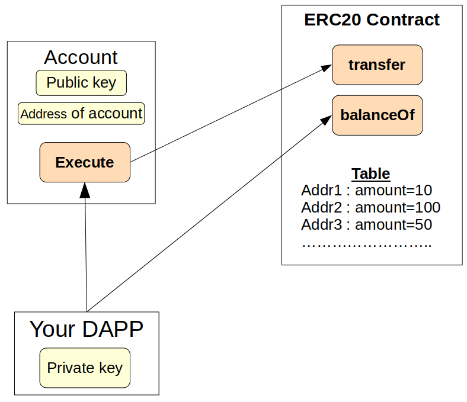

# ERC20 tokens

Based on what has been seen in the previous pages of this guide, we will use an ERC20 contract.

## What's an ERC20

As in Ethereum, a token has an ERC20 contract to manage it. This contract contains a table, that lists the quantity of tokens owned by each involved account:


For example, Account address 2 owns 100 tokens of this ERC20 contract.

Users have the feeling that their tokens are stored in their wallets, but it's absolutely false. You have no list of assets stored in your account contract. In fact, a token has its own ERC20 contract, and the amount of token owned by your account address is stored in this contract.

If you want to have your balance of a token, ask for its ERC20 contract, with the function `ERC20contract.balanceOf(accountAddress)`.

When you want to transfer some tokens in your possession, you have to use the ERC20 contract function `transfer`, through the `account.execute` function (or meta-class methods). In this way, Starknet.js will send to the account contract a message signed with the private key.

This message contains the name of the function to call in the ERC20 contract, with its optional parameters.

The account contract will use the public key to check that you have the private key, then will ask the ERC20 contract to execute the requested function.

This way, the ERC20 contract is absolutely sure that the caller of the transfer function knows the private key of this account.

## STRK token is an ERC20 in Starknet

Unlike Ethereum, the ETH and STRK fee tokens are both ERC20 in Starknet, just like all other tokens. In all networks, their ERC20 contract addresses are:

```typescript
const addrSTRK = '0x04718f5a0fc34cc1af16a1cdee98ffb20c31f5cd61d6ab07201858f4287c938d';
const addrETH = '0x049d36570d4e46f48e99674bd3fcc84644ddd6b96f7c741b1562b82f9e004dc7';
```

## Deploy an ERC20

This example shows deploying an ERC20 token. For basic setup (provider, account), see the [Account Connection guide](../account/connect_account.md).

### Using Contract.factory() (Recommended)

```typescript
import { Contract, CallData, cairo } from 'starknet';

// Deploy ERC20 using the factory method
const erc20Contract = await Contract.factory({
  compiledContract: compiledSierra,
  account: myAccount,
  casm: compiledCasm,
  constructorArguments: {
    name: 'niceToken',
    symbol: 'NIT',
    fixed_supply: cairo.uint256(20n * 10n ** 18n),
    recipient: myAccount.address,
  },
});

console.log('ERC20 deployed at:', erc20Contract.address);
```

### Using Account Methods Directly

```typescript
// Alternative: using declareAndDeploy for more control
const erc20CallData = new CallData(compiledSierra.abi);
const constructorCallData = erc20CallData.compile('constructor', {
  name: 'niceToken',
  symbol: 'NIT',
  fixed_supply: cairo.uint256(20n * 10n ** 18n),
  recipient: myAccount.address,
});

const deployResponse = await myAccount.declareAndDeploy({
  contract: compiledSierra,
  casm: compiledCasm,
  constructorCalldata: constructorCallData,
});

// Create contract instance
const erc20 = new Contract({
  abi: compiledSierra.abi,
  address: deployResponse.deploy.contract_address,
  providerOrAccount: myAccount,
});
```

## Interact with an ERC20

Standard ERC20 operations:

```typescript
// Check balance
const balance = await erc20.balanceOf(myAccount.address);
console.log('Balance:', balance);

// Transfer tokens (direct method call)
const recipient = '0x78662e7352d062084b0010068b99288486c2d8b914f6e2a55ce945f8792c8b1';
const amount = cairo.uint256(1n * 10n ** 18n); // 1 token
const tx = await erc20.transfer(recipient, amount);
await myProvider.waitForTransaction(tx.transaction_hash);

// Approve spending
const spender = '0x...';
const allowanceAmount = cairo.uint256(5n * 10n ** 18n);
const approveTx = await erc20.approve(spender, allowanceAmount);
await myProvider.waitForTransaction(approveTx.transaction_hash);

// Check allowance
const allowance = await erc20.allowance(myAccount.address, spender);
console.log('Allowance:', allowance);
```
