# Provider



The `RpcProvider` object connects your DAPP to the network.

The first thing to do is to define which network you want to interact with (Mainnet, Testnet, Devnet, ...).

Then you need to select a node. A node is a safe way to connect with the Starknet blockchain. You can use:

- a node supplied by a node provider - it can be free or not; it can have limitations or not; it can have WebSocket support or not.
  > RPC node providers are for example Infura, Alchemy, Blast, Lava, Chainstack...
- your own node, located on your local computer or in your local network.
  > you can spin up your own node with Pathfinder, Juno, Papyrus, Deoxys, ...
- a local development node, that simulates a Starknet network. Useful for devs to perform quick tests without spending precious fee token.
  > Main development devnets are Starknet Devnet, Madara, ...

Starknet.js communicates with nodes in accordance to a version of the RPC specification. Most nodes are able to use two RPC versions.  
For example, this node is compatible with v0.8.0 and v0.9.1, using the following entry points:

- "https://starknet-sepolia.public.blastapi.io/rpc/v0_8"
- "https://starknet-sepolia.public.blastapi.io/rpc/v0_9"

From RPC v0.5.0, you can make a request to retrieve the RPC version that a node uses:

```typescript
const resp = await myProvider.getSpecVersion();
console.log('RPC version =', resp);
// result: RPC version = 0.8.0
```

The Starknet.js version must align with the RPC version supported by the chosen node as shown below:

| RPC spec version of your node | Starknet.js version to use    |
| :---------------------------: | ----------------------------- |
|            v0.4.0             | Starknet.js v5.21.1           |
|            v0.5.0             | Starknet.js v5.23.0           |
|            v0.5.1             | Starknet.js v5.29.0 or v6.1.0 |
|            v0.6.0             | Starknet.js v6.24.1           |
|            v0.7.1             | Starknet.js v6.24.1 or v7.x.x |
|            v0.8.0             | Starknet.js v7.x.x or v8.x.x  |
|            v0.9.1             | Starknet.js v8.x.x            |

:::note
From version 6.x.x, Starknet.js is compatible with two RPC spec versions.
:::

With the `RpcProvider` class, you define the Starknet RPC node to use:

```typescript
import { RpcProvider } from 'starknet';
```

## Connect your DAPP to an RPC node provider

### Available nodes

**Mainnet network:**

|                     Node | with public url | with API key |
| -----------------------: | :-------------: | :----------: |
|                  Alchemy |       No        |  v0_8, v0_9  |
|                   Infura |       No        |  v0_8, v0_9  |
|                    Blast |   v0_8, v0_9    |  v0_8, v0_9  |
|                     Lava |   v0_8, v0_9    |  v0_8, v0_9  |
| Local Pathfinder v0.16.2 |   v0_8, v0_9    |     N/A      |
|       Local Juno v0.14.2 |   v0_8, v0_9    |     N/A      |

**Sepolia Testnet network:**

|                     Node | with public url | with API key |
| -----------------------: | :-------------: | :----------: |
|                  Alchemy |       No        |  v0_8, v0_9  |
|                   Infura |       No        |  v0_8, v0_9  |
|                    Blast |   v0_8, v0_9    |      No      |
|                     Lava |   v0_8, v0_9    |      No      |
| Local Pathfinder v0.16.2 |   v0_8, v0_9    |     N/A      |
|       Local Juno v0.14.2 |   v0_8, v0_9    |     N/A      |

**Local Starknet Devnet network:**

|                   Node | with public url | with API key |
| ---------------------: | :-------------: | :----------: |
| starknet-devnet v0.4.x |      v0_8       |     N/A      |
| starknet-devnet v0.5.x |      v0_9       |     N/A      |

:::note
This status has been verified 02/apr/2025.
:::

### Default RPC node

If you don't want to use a specific node or to handle an API key, you can use one of the defaults (using RPC spec v0.9.1):

```typescript
const myProvider = new RpcProvider({ nodeUrl: constants.NetworkName.SN_SEPOLIA });
const myProvider = new RpcProvider({ nodeUrl: constants.NetworkName.SN_MAIN });
// or
const myProvider = new RpcProvider(); // Sepolia
```

> When using this syntax, a random public node will be selected.

Using a specific `nodeUrl` is the better approach, as such nodes will have fewer limitations, their software will be more up to date, and they will be less congested.

Some examples of `RpcProvider` instantiation to connect to RPC node providers:

### Mainnet

```typescript
// Infura node RPC 0.9.1 for Mainnet:
const providerInfuraMainnet = new RpcProvider({
  nodeUrl: 'https://starknet-mainnet.infura.io/v3/' + infuraKey,
});
// Blast node RPC 0.9.1 for Mainnet (0.8 also available):
const providerBlastMainnet = new RpcProvider({
  nodeUrl: 'https://starknet-mainnet.blastapi.io/' + blastKey + '/rpc/v0_9',
});
// Lava node RPC 0.9.1 for Mainnet:
const providerMainnetLava = new RpcProvider({
  nodeUrl: 'https://g.w.lavanet.xyz:443/gateway/strk/rpc-http/' + lavaMainnetKey,
});
// Alchemy node RPC 0.9.1 for Mainnet  (0.8 also available):
const providerAlchemyMainnet = new RpcProvider({
  nodeUrl: 'https://starknet-mainnet.g.alchemy.com/starknet/version/rpc/v0_9/' + alchemyKey,
});
// Public Blast node RPC 0.9.1 for Mainnet (0.8 also available):
const providerBlastMainnet = new RpcProvider({
  nodeUrl: 'https://starknet-mainnet.public.blastapi.io/rpc/v0_9',
});
// Public Lava node RPC 0.9.1 for Mainnet (0.8 also available):
const providerLavaMainnet = new RpcProvider({
  nodeUrl: 'https://rpc.starknet.lava.build/rpc/v0_9',
});
```

> Take care to safely manage your API key. It's a confidential item!

:::tip
If you are not sure about the RPC version (0.8 or 0.9), use:

```typescript
const myProvider = await RpcProvider.create({ nodeUrl: `${myNodeUrl}` });
```

Note that this approach is slower, it performs a request to the node.
:::

### Goerli Testnet

:::info
The Goerli Testnet is no longer in service.
:::

### Sepolia Testnet

```typescript
// Infura node RPC 0.9.1 for Sepolia Testnet:
const providerInfuraSepoliaTestnet = new RpcProvider({
  nodeUrl: 'https://starknet-sepolia.infura.io/v3/' + infuraKey,
});
// Public Blast node RPC 0.9.1 for Sepolia Testnet (0.8 also available):
const providerSepoliaTestnetBlastPublic = new RpcProvider({
  nodeUrl: 'https://starknet-sepolia.public.blastapi.io/rpc/v0_9',
});
// Public Lava node RPC 0.9.1 for Sepolia Testnet (0.8 also available):
const providerSepoliaTestnetLavaPublic = new RpcProvider({
  nodeUrl: 'https://rpc.starknet-testnet.lava.build/rpc/v0_9',
});
```

## Connect to your own node

### Pathfinder

For a local [Pathfinder](https://github.com/eqlabs/pathfinder) node:

```typescript
const myProvider = new RpcProvider({ nodeUrl: '127.0.0.1:9545/rpc/v0_9' });
```

Your node can be located in your local network (example: Pathfinder node running on a computer in your network, launched with this additional option: `--http-rpc 0.0.0.0:9545`).
You can connect with:

```typescript
const myProvider = new RpcProvider({ nodeUrl: '192.168.1.99:9545/rpc/v0_9' });
```

### Juno

For a local [Juno](https://github.com/NethermindEth/juno) node initialize the provider with:

```typescript
const myProvider = new RpcProvider({ nodeUrl: 'http://127.0.0.1:6060/v0_9' });
```

> If Juno is running on a separate computer in your local network, don't forget to add the option `--http-host 0.0.0.0` when launching Juno.

## Devnet

Example of a connection to a local development node, with starknet-devnet:

```typescript
// For RPC 0.8.0 (starknet-devnet v0.3.0)
const myProvider = new RpcProvider({ nodeUrl: 'http://127.0.0.1:5050/rpc' });

// For RPC 0.9.1 (starknet-devnet v0.4.0+)
const myProvider = new RpcProvider({ nodeUrl: 'http://127.0.0.1:5050/rpc' });
```

> If you customized the host or port during starknet-devnet initialization, adapt the script accordingly.

## Batch JSON-RPC

The `BatchClient` class allows requests to be batched together in a single HTTP request, either by the interval amount or at the end of the callback queue if the batch is set to 0. By batching requests, we can reduce the overhead associated with handling individual requests.

#### Example of usage with RpcProvider

```typescript
const myBatchProvider = new RpcProvider({
  batch: 0,
});

const [getBlockResponse, blockHashAndNumber, txCount] = await Promise.all([
  myBatchProvider.getBlock(),
  myBatchProvider.getBlockLatestAccepted(),
  myBatchProvider.getBlockTransactionCount('latest'),
]);

// ... usage of getBlockResponse, blockHashAndNumber, txCount
```

#### Example of direct usage of underlying BatchClient class

```typescript
const myProvider = new RpcProvider();

const myBatchClient = new BatchClient({
  nodeUrl: myProvider.channel.nodeUrl,
  headers: myProvider.channel.headers,
  interval: 0,
});

const [getBlockResponse, blockHashAndNumber, txCount] = await Promise.all([
  myBatchClient.getBlock(),
  myBatchClient.getBlockLatestAccepted(),
  myBatchClient.getBlockTransactionCount('latest'),
]);

// ... usage of getBlockResponse, blockHashAndNumber, txCount
```

## Error handling

The [Starknet RPC specification](https://github.com/starkware-libs/starknet-specs) defines a set of possible errors that the RPC endpoints could return for various scenarios. If such errors arise `starknet.js` represents them with the corresponding [RpcError](../API/classes/RpcError) class where the endpoint error response information is contained within the `baseError` property. Also of note is that the class has an `isType` convenience method that verifies the base error type as shown in the example below.

#### Example

```typescript
try {
  ...
} catch (error) {
  if (error instanceof RpcError && error.isType('UNEXPECTED_ERROR')) { ... }
}
```
