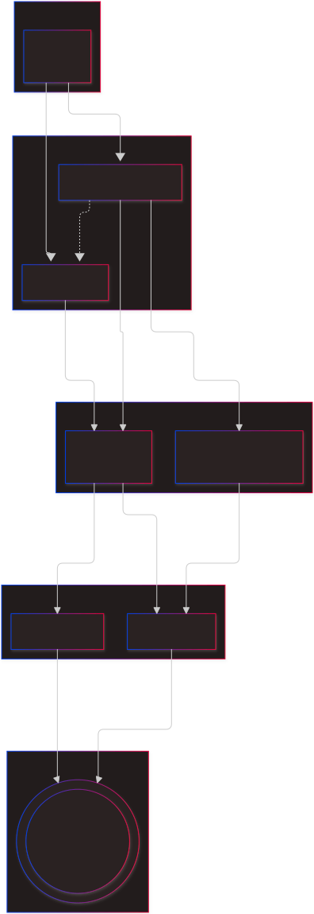

# Provider



The `RpcProvider` object connects your DAPP to the network.

As the diagram shows, a provider is the result of two independent choices:

- **the RPC spec version** your node speaks, which selects the channel — 0.9 or 0.10;
- **the transport** that carries the JSON-RPC envelopes — HTTP or WebSocket.

The two are orthogonal: the same channel code runs over either transport. `RpcProvider` uses HTTP
and is the default. [`WebSocketProvider`](#requests-and-subscriptions-over-websocket) puts requests
and subscriptions on a single socket — and a socket is the only thing that can carry subscriptions,
which is the reason to open one.

The first thing to do is to define which network you want to interact with (Mainnet, Testnet, Devnet, ...).

Then you need to select a node. A node is a safe way to connect with the Starknet blockchain. You can use:

- a node supplied by a node provider - it can be free or not; it can have limitations or not; it can have WebSocket support or not.
  > RPC node providers are for example Infura, Alchemy, Zan, Lava, Chainstack...
- your own node, located on your local computer or in your local network.
  > you can spin up your own node with Pathfinder, Juno, Papyrus, Deoxys, ...
- a local development node, that simulates a Starknet network. Useful for devs to perform quick tests without spending precious fee token.
  > Main development devnets are Starknet Devnet, Madara, ...

Starknet.js communicates with nodes in accordance to a version of the RPC specification. Most nodes are able to use two RPC versions.  
For example, this node is compatible with v0.9.x and v0.10.x, using the following entry points:

- https://starknet-sepolia.g.alchemy.com/starknet/version/rpc/v0_9/" + alchemyKey
- https://starknet-sepolia.g.alchemy.com/starknet/version/rpc/v0_10/" + alchemyKey

From RPC v0.5.0, you can make a request to retrieve the RPC version that a node uses:

```typescript
const resp = await myProvider.getSpecVersion();
console.log('RPC version =', resp);
// result: RPC version = 0.10.3
```

The Starknet.js version must align with the RPC version supported by the chosen node as shown below:

| RPC spec version of your node | Starknet.js version to use            |
| :---------------------------: | ------------------------------------- |
|            v0.7.x             | Starknet.js v6.24.1 or v7.6.4         |
|            v0.8.x             | Starknet.js v7.6.4 or v8.9.2          |
|            v0.9.x             | Starknet.js v8.9.2, v9.4.2 or v10.4.0 |
|            v0.10.0            | Starknet.js v9.4.2 or v10.4.0         |
|            v0.10.1            | Not supported                         |
|            v0.10.2            | Starknet.js v10.4.0                   |
|            v0.10.3            | Starknet.js v10.4.0                   |

:::note

- From version 6.x.x, Starknet.js is compatible with two RPC spec versions.
- To use Starknet v0.14.1 onwards, you need at least Starknet.js v8.6.0.

:::

With the `RpcProvider` class, you define the Starknet RPC node to use:

```typescript
import { RpcProvider } from 'starknet';
```

## Connect your DAPP to an RPC node provider

### Available nodes

**Mainnet network:**

|                     Node |  with public url  |   with API key    |
| -----------------------: | :---------------: | :---------------: |
|                  Alchemy |        No         | v0_8, v0_9, v0_10 |
|                      Zan | v0_8, v0_9, v0_10 | v0_8, v0_9, v0_10 |
|                   Infura |        No         |       v0_8        |
|                     Lava |    v0_8, v0_9     |       v0_8        |
| Local Pathfinder v0.22.6 | v0_8, v0_9, v0_10 |        N/A        |
|       Local Juno v0.16.3 | v0_8, v0_9, v0_10 |        N/A        |

**Sepolia Testnet network:**

|                     Node |  with public url  |   with API key    |
| -----------------------: | :---------------: | :---------------: |
|                  Alchemy |        No         | v0_8, v0_9, v0_10 |
|                      Zan | v0_8, v0_9, v0_10 | v0_8, v0_9, v0_10 |
|                   Infura |        No         |       v0_8        |
|                     Lava |   Not available   |   Not available   |
| Local Pathfinder v0.22.6 | v0_8, v0_9, v0_10 |        N/A        |
|       Local Juno v0.16.3 | v0_8, v0_9, v0_10 |        N/A        |

**Local Starknet Devnet network:**

|                   Node | with public url | with API key |
| ---------------------: | :-------------: | :----------: |
| starknet-devnet v0.2.4 |      v0_7       |     N/A      |
| starknet-devnet v0.4.3 |      v0_8       |     N/A      |
| starknet-devnet v0.6.1 |      v0_9       |     N/A      |
| starknet-devnet v0.9.0 |      v0_10      |     N/A      |

:::note

- This status has been verified 22/jun/2026.
- Zan public node is limited to 15 calls per second, and has also monthly limitation.
- The Lava Sepolia Testnet public node is no longer available.

:::

### Default RPC node

If you don't want to use a specific node or to handle an API key, you can use one of the defaults (using RPC spec v0.10.x):

```typescript
const myProvider = new RpcProvider({ nodeUrl: constants.NetworkName.SN_SEPOLIA });
const myProvider = new RpcProvider({ nodeUrl: constants.NetworkName.SN_MAIN });
// or
const myProvider = new RpcProvider(); // Sepolia
```

> When using this syntax, a random public node will be selected.

:::info

For automatic node version detection, use `RpcProvider.create()` instead of the constructor:

```typescript
// Automatically detects RPC version and configures the correct channel
const defaultProvider = await RpcProvider.create();
const defaultProvider = await RpcProvider.create({ nodeUrl: constants.NetworkName.SN_MAIN });
```

This approach queries the node to determine its RPC specification version and applies the appropriate configuration automatically. Note that this is slightly slower due to the additional network request.

:::

Using a specific `nodeUrl` is the better approach, as such nodes will have fewer limitations, their software will be more up to date, and they will be less congested.

Some examples of `RpcProvider` instantiation to connect to RPC node providers:

### Mainnet

```typescript
// Zan node RPC 0.10.2 for Mainnet (0.9, 0.8 also available):
const providerZanMainnet = new RpcProvider({
  nodeUrl: 'https://api.zan.top/public/starknet-mainnet/rpc/v0_10',
});
// Alchemy node RPC 0.10.3 for Mainnet (0.9, 0.8 also available):
const providerAlchemyMainnet = new RpcProvider({
  nodeUrl: 'https://starknet-mainnet.g.alchemy.com/starknet/version/rpc/v0_10/' + alchemyKey,
});
// Lava node RPC 0.8.1 for Mainnet:
const providerMainnetLava = new RpcProvider({
  nodeUrl: 'https://g.w.lavanet.xyz:443/gateway/strk/rpc-http/' + lavaMainnetKey,
});
// Public Lava node RPC 0.9.0 for Mainnet (0.8 also available):
const providerLavaMainnet = new RpcProvider({
  nodeUrl: 'https://rpc.starknet.lava.build/rpc/v0_9',
});
```

> Take care to safely manage your API key. It's a confidential item!

:::tip

If you are not sure about the RPC version (0.8, 0.9 or 0.10), use:

```typescript
const myProvider = await RpcProvider.create({ nodeUrl: `${myNodeUrl}` });
```

Note that this approach is slower, it performs a request to the node.

:::

### Goerli Testnet

:::info

The Goerli Testnet is no longer in service.

:::

### Sepolia Testnet

```typescript
// Zan node RPC 0.10.3 for Sepolia Testnet (0.9, 0.8 also available):
const providerZanSepoliaTestnet = new RpcProvider({
  nodeUrl: 'https://api.zan.top/public/starknet-sepolia/rpc/v0_10',
});
// Zan node RPC 0.9.0 for Sepolia Testnet (0.8 also available):
const providerZanSepoliaTestnet2 = new RpcProvider({
  nodeUrl: 'https://api.zan.top/public/starknet-sepolia/rpc/v0_9',
});
```

## Connect to your own node

### Pathfinder

For a local [Pathfinder](https://github.com/eqlabs/pathfinder) node:

```typescript
const myProvider = new RpcProvider({ nodeUrl: '127.0.0.1:9545/rpc/v0_10' });
```

Your node can be located in your local network (example: Pathfinder node running on a computer in your network, launched with this additional option: `--http-rpc 0.0.0.0:9545`).
You can connect with:

```typescript
const myProvider = new RpcProvider({ nodeUrl: '192.168.1.99:9545/rpc/v0_10' });
```

### Juno

For a local [Juno](https://github.com/NethermindEth/juno) node initialize the provider with:

```typescript
const myProvider = new RpcProvider({ nodeUrl: 'http://127.0.0.1:6060/v0_10' });
```

> If Juno is running on a separate computer in your local network, don't forget to add the option `--http-host 0.0.0.0` when launching Juno.

## Devnet

Example of a connection to a local development node, with starknet-devnet:

```typescript
// For RPC 0.10.x (starknet-devnet v0.8.2)
const myProvider = new RpcProvider({ nodeUrl: 'http://127.0.0.1:5050/rpc' });

// For RPC 0.9.1 (starknet-devnet v0.6.1)
const myProvider = new RpcProvider({ nodeUrl: 'http://127.0.0.1:5050/rpc' });
```

> If you customized the host or port during starknet-devnet initialization, adapt the script accordingly.

## Requests and subscriptions over WebSocket

`RpcProvider` sends every request over HTTP, and that stays the right default. `WebSocketProvider`
is the variant that keeps one socket open and uses it for both requests and subscriptions:

```typescript
import { WebSocketProvider } from 'starknet';

const myProvider = new WebSocketProvider({
  nodeUrl: 'wss://your-starknet-node/rpc/v0_10',
});

// The usual provider surface, unchanged:
const blockNumber = await myProvider.getBlockNumber();

// Plus the subscriptions, on the same connection:
const sub = await myProvider.subscriptions.subscribeNewHeads();
sub.on((header) => console.log('New block', header.block_number));
```

It **is** an `RpcProvider`, so `Account` and `Contract` accept it without knowing the difference:

```typescript
const myAccount = new Account({ provider: myProvider, address, signer: privateKey });
```

Like `RpcProvider.create()`, `WebSocketProvider.create()` asks the node which spec version it speaks
and builds the matching channels, at the cost of one round trip:

```typescript
const myProvider = await WebSocketProvider.create({
  nodeUrl: 'wss://your-starknet-node/rpc/v0_10',
});
```

Unlike an HTTP provider, it holds an open connection, so release it when you are done:

```typescript
myProvider.dispose();
```

The WebSocket address is rarely the HTTP one with a `wss://` scheme — the port and path depend on
the node. See [WebSocket endpoints](./websocket_channel.md#websocket-endpoints) for working
examples, and the [WebSocket guide](./websocket_channel.md) for subscriptions, reconnection and
connection sharing.

### Choosing HTTP or WebSocket

**Subscriptions need a WebSocket.** A node only pushes new blocks, events or transaction status over
a socket. Any application that reacts to the chain instead of polling it needs one, and this is the
decisive argument — the reason `WebSocketProvider` exists at all.

**One connection instead of two.** Once the socket is open for subscriptions, sending the requests
through it as well spares you a second, parallel connection to the same node.

**It is also faster, moderately.** On a realistic transaction workload, the starknet.js test suite
runs about 6 % faster over WebSocket than over HTTP, at identical code and assertions. The figure
comes from a paired comparison — every file run twice in the same CI job, against the same node,
once per transport — repeated on Juno and Pathfinder, in RPC 0.9 and 0.10. All four runs agree in
direction, between 4 % and 8 %. Keep the effect in proportion: most of that time is spent waiting
for the chain, which no transport can accelerate, so the gain is diluted. It is a welcome bonus,
not a reason to switch.

**What HTTP gives you in exchange is having nothing to manage**: no connection state, no
reconnection, no lifecycle. A socket can drop, it is subject to per-node limits (connections per IP,
simultaneous subscriptions, maximum socket lifetime), and it cannot be serialized into a store or
into React state. In a browser it also buys less than it looks for requests alone, since HTTP/2
keep-alive already amortizes connection setup.

So: **HTTP by default, WebSocket when you subscribe.** A third setup stays perfectly sensible if you
prefer it — an `RpcProvider` over HTTP for the requests, and a `WebSocketChannel` alongside for the
subscriptions only.

## Batch JSON-RPC

The `BatchClient` class allows requests to be batched together in a single HTTP request, either by the interval amount or at the end of the callback queue if the batch is set to 0. By batching requests, we can reduce the overhead associated with handling individual requests.

#### Example of usage with RpcProvider

```typescript
const myBatchProvider = new RpcProvider({
  batch: 0,
});

const [getBlockResponse, blockHashAndNumber, txCount] = await Promise.all([
  myBatchProvider.getBlock(),
  myBatchProvider.getBlockLatestAccepted(),
  myBatchProvider.getBlockTransactionCount('latest'),
]);

// ... usage of getBlockResponse, blockHashAndNumber, txCount
```

#### Example of direct usage of underlying BatchClient class

```typescript
const myProvider = new RpcProvider();

const myBatchClient = new BatchClient({
  nodeUrl: myProvider.channel.nodeUrl,
  headers: myProvider.channel.headers,
  interval: 0,
});

const [getBlockResponse, blockHashAndNumber, txCount] = await Promise.all([
  myBatchClient.getBlock(),
  myBatchClient.getBlockLatestAccepted(),
  myBatchClient.getBlockTransactionCount('latest'),
]);

// ... usage of getBlockResponse, blockHashAndNumber, txCount
```

## Error handling

The [Starknet RPC specification](https://github.com/starkware-libs/starknet-specs) defines a set of possible errors that the RPC endpoints could return for various scenarios. If such errors arise `starknet.js` represents them with the corresponding [RpcError](../API/classes/RpcError) class where the endpoint error response information is contained within the `baseError` property. Also of note is that the class has an `isType` convenience method that verifies the base error type as shown in the example below.

#### Example

```typescript
try {
  ...
} catch (error) {
  if (error instanceof RpcError && error.isType('UNEXPECTED_ERROR')) { ... }
}
```
