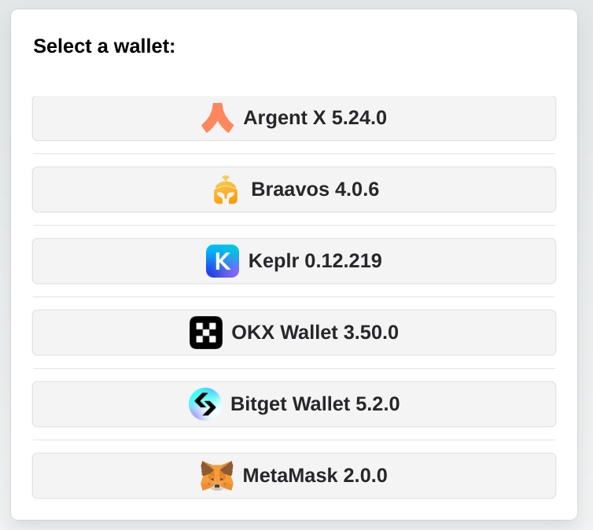
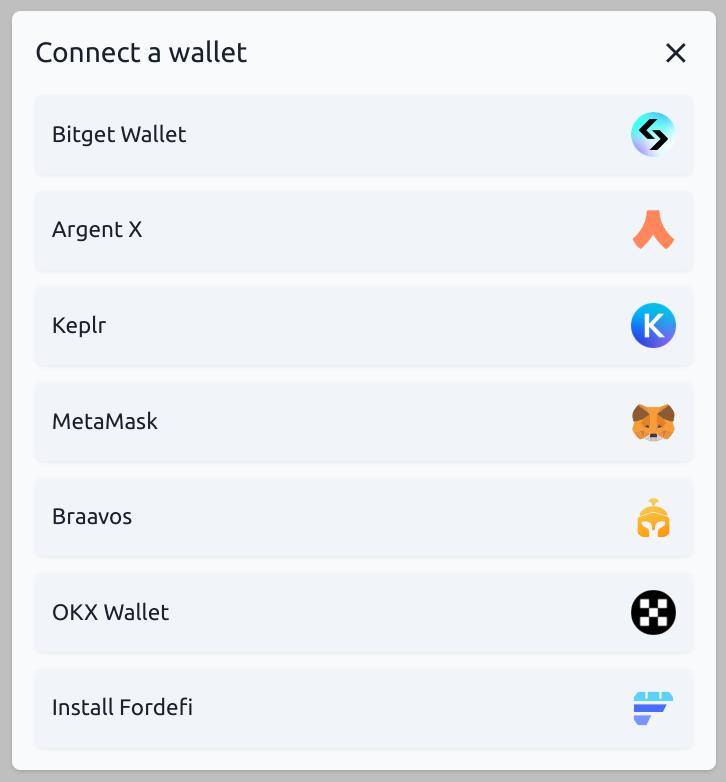

# WalletAccount

**Use wallets to sign transactions in your DAPP.**

The [`WalletAccount`](../API/classes/WalletAccountV5) class is similar to the regular [`Account`](../API/classes/Account) class, with the added ability to ask a Wallet (such as ArgentX, Braavos, etc...) to sign and send transactions. Some other cool functionalities will be detailed hereunder.

The private key of a `WalletAccount` is held in the Wallet, so any signature is managed by the wallet. With this approach DAPPs don't need to manage the security for any private key.

:::caution
This class functions only within the scope of a DAPP. It can't be used in a Node.js script.
:::

## Architecture

In your DAPP, you have to use the `get-starknet` library to select and interact with a wallet.


`get-starknet v4` is working only in desktop browsers.  
`get-starknet v5` is working also in mobile browsers.  
You can use the `WalletAccount` class with `get-starknet v4`, and the `WalletAccountV5` class with `get-starknet v5`.

## With get-starknet v5

When retrieving information from Starknet, a `WalletAccountV5` instance will read directly from the blockchain. That is why at the initialization of a `WalletAccountV5` a [`RpcProvider`](../API/classes/ProviderInterface) instance is a required parameter, it will be used for all reading activities.

If you want to write to Starknet the `WalletAccountV5` will ask the wallet to sign and send the transaction using the Starknet Wallet API to communicate.

As several wallets can be installed in your desktop/mobile, the `WalletAccountV5` needs the ID of one of the available wallets. You can ask `get-starknet v5` to provide a list of available wallets, and you have to select one of them, called a `WalletWithStarknetFeatures` Object.

### Select a Wallet

Using the `get-starknet/discovery v5` library you have to create your own UI and logic to select one of the available wallets. An example in a DAPP: [**here**](<https://github.com/PhilippeR26/Cairo1JS/blob/getStarknetv5/src/app/(site)/components/client/ConnectWallet/SelectWallet.tsx>). In this example you can select only the wallets compatible with the Starknet Wallet API.  


Instantiating a new `WalletAccountV5`:

```typescript
import { createStore, type Store } from '@starknet-io/get-starknet/discovery'; // v5.0.0 min
import { type WalletWithStarknetFeatures } from '@starknet-io/get-starknet/standard/features';
import { WalletAccountV5, walletV5 } from 'starknet'; // v7.2.0 min
const myFrontendProviderUrl = 'https://free-rpc.nethermind.io/sepolia-juno/v0_8';
const store: Store = createStore();
const walletsList: WalletWithStarknetFeatures[] = store.getWallets();
// Create you own Component to select one of these wallets.
// Hereunder, selection of 2nd wallet of the list.
const selectedWallet: WalletWithStarknetFeatures = walletsList[1];
const myWalletAccount: WalletAccountV5 = await WalletAccountV5.connect(
  { nodeUrl: myFrontendProviderUrl },
  selectedWallet
);
```

The wallet is connected to this blockchain to write in Starknet:

```typescript
const writeChainId = await walletV5.requestChainId(myWalletAccount.walletProvider);
```

and to this blockchain to read Starknet:

```typescript
const readChainId = await myWalletAccount.getChainId();
```

### Subscription to events

You can subscribe to one event with `get-starknet v5`:

`onChange`: Triggered each time you change the current account or the current network in the wallet.

```typescript
import type { StandardEventsChangeProperties } from "@wallet-standard/features";
const addEvent = useCallback((change: StandardEventsChangeProperties) => {
    console.log("Event detected", change.accounts);
    if (change.accounts?.length) {
        console.log("account event=", change.accounts[0].address);
        setCurrentAccount(change.accounts[0].address);
        console.log("network event=", change.accounts[0].chains[0]);
        setCurrentChainId(change.accounts[0].chains[0].slice(9));
    }
}, []);
...
useEffect(() => {
    console.log("Subscribe events...");
    selectedWalletAccountV5?.onChange(addEvent);
    return () => {
        console.log("Unsubscribe to events...");
        selectedWalletAccountV5?.unsubscribeChange();
}
}
, [selectedWalletAccountV5, addEvent]);
```

## With get-starknet v4

The concept of Starknet reading/writing is the same when using `get-starknet v4` and the `WalletAccount` class.

### Select a Wallet

You can ask the `get-starknet v4` library to display a window with a list of wallets, then it will ask you to make a choice. It will return the `StarknetWindowObject` Object (referred to as SWO hereunder) of the wallet the user selected.


Instantiating a new `WalletAccount`:

```typescript
import { connect } from '@starknet-io/get-starknet'; // v4.0.3 min
import { WalletAccount, wallet } from 'starknet'; // v7.0.1 min
const myFrontendProviderUrl = 'https://free-rpc.nethermind.io/sepolia-juno/v0_8';
// standard UI to select a wallet:
const selectedWalletSWO = await connect({ modalMode: 'alwaysAsk', modalTheme: 'light' });
const myWalletAccount = await WalletAccount.connect(
  { nodeUrl: myFrontendProviderUrl },
  selectedWalletSWO
);
```

:::tip
Using the `get-starknet-core` v4 library you can create your own UI and logic to select the wallet. An example of DAPP using a custom UI [**here**](https://github.com/PhilippeR26/Starknet-WalletAccount/blob/53514a5529c4aebe9e7c6331186e83b7a7310ce0/src/app/components/client/WalletHandle/SelectWallet.tsx), in this example you can select only the wallets compatible with the Starknet Wallet API.  
:::

The wallet is connected to this blockchain to write in Starknet:

```typescript
const writeChainId = await wallet.requestChainId(myWalletAccount.walletProvider);
```

and to this blockchain to read Starknet:

```typescript
const readChainId = await myWalletAccount.getChainId();
```

### Subscription to events

You can subscribe to 2 events with `get-starknet v4`:

- `accountsChanged`: Triggered each time you change the current account in the wallet.
- `networkChanged`: Triggered each time you change the current network in the wallet.

At each change of the network, both account and network events are emitted.  
At each change of the account, only the account event is emitted.

#### Subscribe

##### accountsChanged

```typescript
const handleAccount: AccountChangeEventHandler = (accounts: string[] | undefined) => {
  if (accounts?.length) {
    const textAddr = accounts[0]; // hex string
    setChangedAccount(textAddr); // from a React useState
  }
};
selectedWalletSWO.on('accountsChanged', handleAccount);
```

##### networkChanged

```typescript
const handleNetwork: NetworkChangeEventHandler = (chainId?: string, accounts?: string[]) => {
  if (!!chainId) {
    setChangedNetwork(chainId); // from a React useState
  }
};
selectedWalletSWO.on('networkChanged', handleNetwork);
```

#### Unsubscribe

Similar to subscription, by using the `.off` method.

```typescript
selectedWalletSWO.off('accountsChanged', handleAccount);
selectedWalletSWO.off('networkChanged', handleNetwork);
```

:::info
You can subscribe both with the SWO or with a `WalletAccount` instance.  
The above examples are using the SWO, because it is the simpler way to process.
:::

## WalletAccount usage

### Use as an Account

Once a new `WalletAccount` or `WalletAccountV5` is created, you can use all the power of Starknet.js, exactly as a with a normal `Account` instance, for example `myWalletAccount.execute(call)` or `myWalletAccount.signMessage(typedMessage)`:

```typescript
const claimCall = airdropContract.populate('claim_airdrop', {
  amount: amount,
  proof: proof,
});
const resp = await myWalletAccount.execute(claimCall);
```


### Use in a Contract instance

You can connect a `WalletAccount` with a [`Contract`](../API/classes/Contract) instance. All reading actions are performed by the provider of the `WalletAccount`, and all writing actions (that need a signature) are performed by the wallet.

```typescript
const lendContract = new Contract(contract.abi, contractAddress, myWalletAccount);
const qty = await lendContract.get_available_asset(addr); // use of the WalletAccount provider
const resp = await lendContract.process_lend_asset(addr); // use of the wallet
```

### Use as a Provider

Your `WalletAccount` instance can be used as a provider:

```typescript
const bl = await myWalletAccount.getBlockNumber();
// bl = 2374543
```

You can use all the methods of the `RpcProvider` class. Under the hood, the `WalletAccount` will use the RPC node that you indicated at its instantiation.

### Direct access to the wallet API entry points

The `WalletAccount` class is able to interact with all the entrypoints of the Starknet Wallet API, including some functionalities that do not exists in the `Account` class.

A full description of this API can be found [**here**](https://github.com/starknet-io/get-starknet/blob/master/packages/core/documentation/walletAPIdocumentation.md).

Some examples:

#### Request to change the wallet network

Using your `WalletAccount`, you can ask the wallet to change its current network:

```typescript
useEffect(
  () => {
    if (!isValidNetwork()) {
      const tryChangeNetwork = async () => {
        await myWalletAccount.switchStarknetChain(constants.StarknetChainId.SN_SEPOLIA);
      };
      tryChangeNetwork().catch(console.error);
    }
  },
  [chainId] // from a networkChanged event
);
```


#### Request to display a token in the wallet

Using your `WalletAccount`, you can ask the wallet to display a new token:

```typescript
useEffect(
  () => {
    const fetchAddToken = async () => {
      const resp = await myWalletAccount.watchAsset({
        type: 'ERC20',
        options: {
          address: erc20Address,
        },
      });
    };
    if (isAirdropSuccess) {
      fetchAddToken().catch(console.error);
    }
  },
  [isAirdropSuccess] // from a React useState
);
```


### Changing the network or account

When you change the network or the account address a `WalletAccount` instance is automatically updated, however, this can lead to unexpected behavior if one is not careful (reads and writes targeting different networks, problems with Cairo versions of the accounts, ...).

:::warning RECOMMENDATION
It is strongly recommended to create a new `WalletAccount` instance each time the network or the account address is changed.
:::
