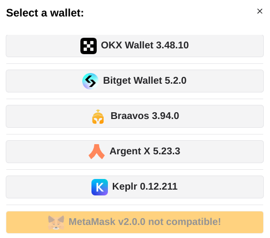

# WalletAccount

**Use wallets (like Braavos & ArgentX) to sign your transactions in your DAPP.**

The `WalletAccount` class is similar to the regular `Account` class, but is also able to ask a browser wallet to sign and send a transaction. Some other cool functionalities will be detailed hereunder.

The private key of a WalletAccount is held in a browser wallet (as ArgentX or Braavos), and any signature is managed by the wallet. You don't have to manage in your DAPP the security of any private key.

:::caution
This class is working only in the scope of a DAPP. You can't use it in a node.js script.
:::

## Architecture


If you want to read Starknet, the WalletAccount will read directly the blockchain. That's why at the initialization of a WalletAccount, you need to put in the parameters a Provider instance. It will be used for all reading activities.

If you want to write to Starknet, the WalletAccount will ask the browser Wallet to sign and send the transaction, using the Starknet Wallet API to communicate.  
As several Wallets can be installed in your browser, the WalletAccount needs the ID of one of the available wallets. You can ask `get-starknet` to display a list of available wallets and to provide as a response the identifier of the selected wallet, called a `Starknet Windows Object` (named SWO from now).

## Select a Wallet

You can ask the `get-starknet` v4 library to display a list of wallets, then it will ask you to make a choice. It will return the SWO of the wallet the user selected.  
Using the `get-starknet-core` v4 library, you can create your own UI and logic to select the wallet. An example of DAPP using a custom UI : [**here**](https://github.com/PhilippeR26/Starknet-WalletAccount/blob/main/src/app/components/client/WalletHandle/SelectWallet.tsx), where you can select only the wallets compatible with the Starknet wallet API.  


So, you instantiate a new WalletAccount with :

```typescript
import { connect } from 'get-starknet'; // v4.0.0 min
import { WalletAccount } from 'starknet'; // v6.10.0 min
const myFrontendProviderUrl = 'https://free-rpc.nethermind.io/sepolia-juno/v0_7';
// standard UI to select a wallet :
const selectedWalletSWO = await connect({ modalMode: 'alwaysAsk', modalTheme: 'light' });
const myWalletAccount = new WalletAccount({ nodeUrl: myFrontendProviderUrl }, selectedWalletSWO);
```

## Use as an account

Once the new WalletAccount is created, you can use all the power of Starknet.js, exactly as a with a normal Account instance.  
You can use for example `myWalletAccount.execute(call)` or `myWalletAccount.signMessage(typedMessage)` :

```typescript
const claimCall = airdropContract.populate('claim_airdrop', {
  amount: amount,
  proof: proof,
});
const resp = await myWalletAccount.execute(claimCall);
```


## Use in a Contract instance

You can connect a WalletAccount with a Contract instance. All reading actions are performed by the provider of the WalletAccount, and all writing actions (that needs a signature) are performed by the browser wallet.

```typescript
const lendContract = new Contract(contract.abi, contractAddress, myWalletAccount);
const qty = await lendContract.get_available_asset(addr); // use of the WalletAccount provider.
const resp = await lendContract.process_lend_asset(addr); // use of the browser wallet
```

## Use as a provider

Your WalletAccount instance can be used as a provider :

```typescript
const bl = await myWalletAccount.getBlockNumber();
// bl = 2374543
```

You can use all the methods of the RpcProvider class. Under the hood, the WalletAccount will use the rpc node that you indicated at its instantiation.

## Subscription to events

You can subscribe to 2 events :

- `accountsChanged` : Triggered each time you change the current account in the wallet.
- `networkChanged` : Triggered each time you change the current network in the wallet.

At each change of the network, both account and network events are occurring.  
At each change of the account, only the account event is occurring.

### Subscribe

#### accountsChanged

```typescript
const handleAccount: AccountChangeEventHandler = (accounts: string[] | undefined) => {
  if (accounts?.length) {
    const textAddr = accounts[0]; // hex string
    setChangedAccount(textAddr); // from a React useState
  }
};
selectedWalletSWO.on('accountsChanged', handleAccount);
```

#### networkChanged

```typescript
const handleNetwork: NetworkChangeEventHandler = (chainId?: string, accounts?: string[]) => {
  if (!!chainId) {
    setChangedNetwork(chainId);
  } // from a React useState
};
selectedWalletSWO.on('networkChanged', handleNetwork);
```

### Un-subscribe :

Similar to subscription, using `.off` method.

```typescript
selectedWalletSWO.off('accountsChanged', handleAccount);
selectedWalletSWO.off('networkChanged', handleNetwork);
```

:::info
You can subscribe both with the SWO or with a WalletAccount instance.  
The above examples are using the SWO, because it's the simpler way to process.
:::

## Direct access to the wallet API entry points

The WalletAccount class is able to interact with all the entrypoints of the Starknet wallet API, including some functionalities that do not exists in an Account class.
You have a full description of this API [**here**](https://github.com/PhilippeR26/Starknet-WalletAccount/blob/main/doc/walletAPIspec.md).

Some examples:

### Request a change of wallet network

Using your WalletAccount, you can ask the wallet to change its current network:

```typescript
useEffect(
  () => {
    if (!isValidNetwork()) {
      const tryChangeNetwork = async () => {
        await myWalletAccount.switchStarknetChain(constants.StarknetChainId.SN_SEPOLIA);
      };
      tryChangeNetwork().catch(console.error);
    }
  },
  [chainId] // from a networkChanged event
);
```


### Request to display a token in the wallet

Using your WalletAccount, you can ask the wallet to display a new token:

```typescript
useEffect(
  () => {
    const fetchAddToken = async () => {
      const resp = await myWalletAccount.watchAsset({
        type: 'ERC20',
        options: {
          address: erc20Address,
        },
      });
    };
    if (isAirdropSuccess) {
      fetchAddToken().catch(console.error);
    }
  },
  [isAirdropSuccess] // from a React useState
);
```


## Change of network or account

When you change the network or the account address, the WalletAccount is automatically updated, but it can lead to tricky behavior (read and write in different networks, problems of Cairo versions of the accounts, ....).  
:::warning RECOMMENDATION
It's strongly recommended to create a new WalletAccount instance each time the network or the account address is changed.
:::
