# Why Starknet JS

Starknet.js is your gateway to building powerful decentralized applications (dApps) on Starknet. As the official JavaScript/TypeScript library for Starknet, it provides a comprehensive suite of tools to interact with the Starknet network, making blockchain development accessible and efficient.

## Why Choose Starknet.js?

- 🚀 **Easy Integration**: Simple, intuitive APIs for interacting with Starknet
- 🔒 **Type Safety**: Full TypeScript support with smart contract type generation
- ⚡ **High Performance**: Optimized for handling Starknet's high throughput
- 🛠️ **Complete Toolset**: Everything you need for Starknet development in one package
- 📚 **Well Documented**: Extensive documentation and examples

## Architecture Overview

The following diagrams illustrate how Starknet.js connects your dApp to the Starknet network:

This architecture enables:

- Seamless communication between your dApp and Starknet nodes
- Efficient handling of transactions and contract interactions
- Secure account management and transaction signing
- Real-time event monitoring and state updates

Key components and their interactions:

1. **Your dApp** interacts with Starknet.js through its JavaScript/TypeScript interface
2. **Starknet.js Core Components**:
   - Provider handles network communication
   - Account manages wallet operations and transactions
   - Contract facilitates smart contract interactions
   - Utilities provide support functions
3. **Starknet Network** processes transactions and maintains the blockchain state

## Network Compatibility

Connect your dApp to any Starknet environment:

| Network                                                   | Description                              | Use Case              |
| --------------------------------------------------------- | ---------------------------------------- | --------------------- |
| [Mainnet](https://starkscan.co)                           | Production network (Layer 2 of Ethereum) | Live applications     |
| [Testnet](https://sepolia.starkscan.co/)                  | Test network (Layer 2 of Sepolia)        | Testing & development |
| [Devnet](https://github.com/0xSpaceShard/starknet-devnet) | Local development network                | Rapid development     |

You can also connect to:

- Custom Starknet deployments
- Local Starknet nodes (connected to mainnet or testnet)

## Core Components

### 1. Provider & Channel

- `RpcProvider`: Your connection to Starknet nodes
- `RpcChannel`: Handles low-level communication with the network
- Support for both HTTP and WebSocket connections

### 2. Account Management

The `Account` class is your primary interface for:

- 💼 Managing wallets and tokens
- 💰 Handling transaction fees
- 📝 Signing and sending transactions
- 🔐 Managing account security

### 3. Contract Interaction

The `Contract` class provides:

- 📖 Reading contract state
- ✍️ Writing to contracts
- 🔄 Handling contract events
- 🧪 Testing contract interactions

### 4. Utility Tools

- `Signer`: Cryptographic operations and message signing
- `Utils`: Helper functions for data conversion and formatting
- `CallData`: Smart contract interaction utilities

## Prerequisites

Before diving into Starknet.js, familiarize yourself with:

1. [Starknet Documentation](https://docs.starknet.io/documentation/) - Understanding the network
2. [Cairo Programming](https://book.cairo-lang.org/) - Smart contract development
3. JavaScript/TypeScript fundamentals

## Next Steps

Ready to start building? Head to our [Getting Started](./intro.md) guide to begin your journey with Starknet.js!
