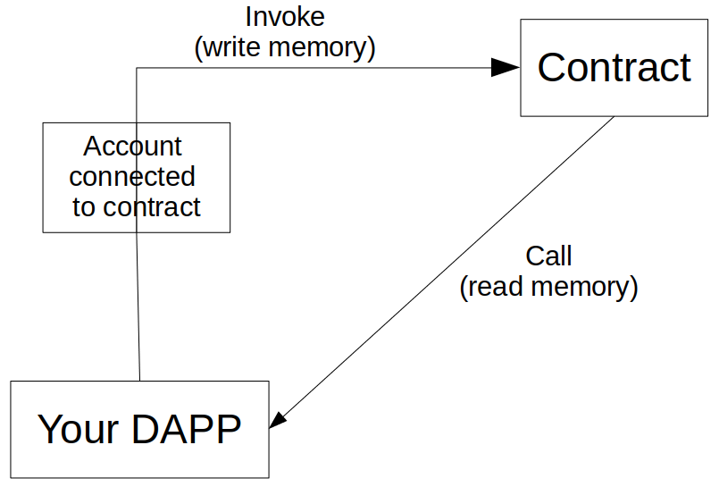

# Interact with your contract

Once your provider, contract, and account are connected, you can interact with the contract:

- you can read the memory of the contract, without fees.
- you can write to memory, but you have to pay fees.
  - On Mainnet, you have to pay fees with a bridged ETH token.
  - On Testnet, you have to pay with a bridged Sepolia ETH token.
  - On devnet, you have to pay with a dummy ETH token.

Your account should be funded enough to pay fees (0.01 ETH should be enough to start).



Here we will interact with a `test.cairo` contract (Cairo 1) already deployed in Sepolia Testnet at the address:

- [0x02d2a4804f83c34227314dba41d5c2f8a546a500d34e30bb5078fd36b5af2d77](https://sepolia.starkscan.co/contract/0x02d2a4804f83c34227314dba41d5c2f8a546a500d34e30bb5078fd36b5af2d77)

This contract contains a storage variable called `balance`.

- It can be read with the `fn get_balance(self: @TContractState) -> felt252;`
- Balance can be modified with `fn increase_balance(ref self: TContractState, amount: felt252);`

```typescript
import { RpcProvider, Contract, Account, ec, json } from 'starknet';
```

## 🔍 Read from contract memory, with meta-class

To read the balance, you need to connect an RpcProvider and a Contract.  
You have to call Starknet, with the use of the meta-class method: `contract.function_name(params)` (here `params` is not necessary, because there are no parameters for the `get_balance` function).

```typescript
//initialize provider with a Sepolia Testnet node
const provider = new RpcProvider({ nodeUrl: `${myNodeUrl}` });
// Connect the deployed Test contract in Sepolia Testnet
const testAddress = '0x02d2a4804f83c34227314dba41d5c2f8a546a500d34e30bb5078fd36b5af2d77';

// read abi of Test contract
const { abi: testAbi } = await provider.getClassAt(testAddress);
if (testAbi === undefined) {
  throw new Error('no abi.');
}
const myTestContract = new Contract(testAbi, testAddress, provider);

// Interaction with the contract with call
const bal1 = await myTestContract.get_balance();
console.log('Initial balance =', bal1); // Cairo 1 contract
// With Cairo 0 contract, `bal1.res.toString()` because the return value is called 'res' in the Cairo 0 contract.
// With Cairo 1 contract, the result value is in `bal1`, as bigint.
```

## ✍️ Write to contract memory, with meta-class

To increase the balance, you need in addition a connected and funded Account.

You have to invoke Starknet, with the use of the meta-class method: `contract.function_name(params)`

> After the invoke, you have to wait the incorporation of the modification of Balance in the network, with `await provider.waitForTransaction(transaction_hash)`

Here is an example of how to increase and check the balance:

```typescript
//initialize provider with a Sepolia Testnet node
const provider = new RpcProvider({ nodeUrl: `${myNodeUrl}` });
// connect your account. To adapt to your own account:
const privateKey0 = process.env.OZ_ACCOUNT_PRIVATE_KEY;
const account0Address = '0x123....789';

const account0 = new Account(provider, account0Address, privateKey0);

// Connect the deployed Test contract in Testnet
const testAddress = '0x02d2a4804f83c34227314dba41d5c2f8a546a500d34e30bb5078fd36b5af2d77';

// read abi of Test contract
const { abi: testAbi } = await provider.getClassAt(testAddress);
if (testAbi === undefined) {
  throw new Error('no abi.');
}
const myTestContract = new Contract(testAbi, testAddress, provider);

// Connect account with the contract
myTestContract.connect(account0);

// Interactions with the contract with meta-class
const bal1 = await myTestContract.get_balance();
console.log('Initial balance =', bal1); // Cairo 1 contract
const myCall = myTestContract.populate('increase_balance', [10]);
const res = await myTestContract.increase_balance(myCall.calldata);
await provider.waitForTransaction(res.transaction_hash);

const bal2 = await myTestContract.get_balance();
console.log('Final balance =', bal2);
```

`Contract.populate()` is the recommended method to define the parameters to call/invoke the Cairo functions.

## ✍️ Send a V3 transaction, paying fees with STRK

We have seen in the previous chapter how to send a "legacy" transaction, with fees paid in ETH.  
You can also send transactions and pay the fees with the STRK token. It is called a V3 transaction.  
To perform a such transaction, you need:

- an account compatible with V3 transactions.
- Some STRK tokens in this account.
- a node with a rpc spec 0.6.0.
- Starknet.js v6.

You have to initialize the account this way :

```typescript
const account0 = new Account(
  provider,
  accountAddress0,
  privateKey0,
  undefined,
  constants.TRANSACTION_VERSION.V3
);
```

By this way, all the transactions sent by this account are by default performed in V3 (paid with STRK). If the transactionVersion parameter is omitted, "legacy" transactions will be performed.

One example of V3 transaction, using account.execute :

```typescript
const myCall = myTestContract.populate('test_fail', [100]);
const maxQtyGasAuthorized = 1800n; // max quantity of gas authorized
const maxPriceAuthorizeForOneGas = 12n * 10n ** 9n; // max FRI authorized to pay 1 gas (1 FRI=10**-18 STRK)
console.log('max authorized cost =', maxQtyGasAuthorized * maxPriceAuthorizeForOneGas, 'FRI');
const { transaction_hash: txH } = await account0.execute(myCall, {
  version: 3,
  maxFee: 10 ** 15,
  feeDataAvailabilityMode: RPC.EDataAvailabilityMode.L1,
  tip: 10 ** 13,
  paymasterData: [],
  resourceBounds: {
    l1_gas: {
      max_amount: num.toHex(maxQtyGasAuthorized),
      max_price_per_unit: num.toHex(maxPriceAuthorizeForOneGas),
    },
    l2_gas: {
      max_amount: num.toHex(0),
      max_price_per_unit: num.toHex(0),
    },
  },
});
const txR = await provider.waitForTransaction(txH);
if (txR.isSuccess()) {
  console.log('Paid fee =', txR.actual_fee);
}
```

Yes, it's much more complicated. Let's see in detail.  
In fact, Starknet v0.13.0 is using few of these parameters :  
`feeDataAvailabilityMode: RPC.EDataAvailabilityMode.L2` is not yet accepted.  
`feeDataAvailabilityMode: RPC.EDataAvailabilityMode.L1` is accepted.  
`maxFee : 10**15` : value not taken into account in V3  
`tip: 10**13` : value not yet taken into account  
`paymasterData: []` : only empty value currently authorized

```typescript
l1_gas: {
      max_amount: num.toHex(2000n),  // max quantity of gas authorized
    max_price_per_unit: num.toHex(12n * 10n ** 9n) // max FRI authorized to pay 1 gas (here 12 G FRI)
},
l2_gas: {
    max_amount: num.toHex(0), // currently set to 0
    max_price_per_unit: num.toHex(0) // currently set to 0
}
```

Take care that these gas values have to be `string` type.  
In future versions, Starknet will uses all these parameters.  
The `version` parameter is optional (account settings by default), and overtakes the `transactionVersion` parameter of the Account instantiation. Here, it's not really necessary to use this parameter, as the same transaction version has been already initialized in the account instantiation.

## Sending sequential transactions

If you intend to send sequential transactions through the contract object, like so:

```typescript
const tx = await cairo1Contract.array2d_ex(data);
const tx1 = await cairo1Contract.array2d_ex(data);
```

Be sure to use `waitForTransaction` between the calls, because you may experience issues with the nonce not incrementing:

```typescript
const tx = await cairo1Contract.array2d_ex(data);
await provider.waitForTransaction(tx.transaction_hash);
const tx1 = await cairo1Contract.array2d_ex(data);
await provider.waitForTransaction(tx1.transaction_hash);
```

## Write several operations, with Account.execute

In a Starknet transaction, you can include several invoke operations. It will be performed with `account.execute`.

We will later see this case more in detail in this dedicated [guide](multiCall.md), but in summary, you use this command with the following parameters:

- address of the contract to invoke
- name of the function to invoke
- and an array of parameters for this function

```typescript
const result = await account.execute({
  contractAddress: myContractAddress,
  entrypoint: 'transfer',
  calldata: CallData.compile({
    recipient: receiverAddress,
    amount: cairo.uint256(100000n),
  }),
});
await provider.waitForTransaction(result.transaction_hash);
```

## Other existing methods

Some other useful methods to interact with Starknet:

### Function name defined in the code

If you want to call a function with its name contained in a variable:

```typescript
const listFn = ['calc-sum', 'calc-hash', 'calc-proof'];
// fnChoice is a number defined during execution
const res = await myTestContract[listFn[fnChoice]](200, 234567897n, 865423);
```

### Light and fast call

If you want to have a very fast execution, with minimum resource usage:

```typescript
const specialParameters: Calldata = ['2036735872918048433518', '5130580', '18'];
const getResponse = await myAccount.call('get_bal', specialParameters, { parseRequest: false });
```

You provide the low-level numbers expected by Starknet, without any parsing or checking. See more details [here](define_call_message.md#parse-configuration).

## Transaction receipt response

You can interpret the transaction receipt response to check whether it succeeded or not.

```typescript
const result = await account.execute(myCall);
const txR = await provider.waitForTransaction(result.transaction_hash);

console.log(txR.statusReceipt, txR.value);
console.log(txR.isSuccess(), txR.isRejected(), txR.isReverted(), txR.isError());

txR.match({
  success: () => {
    console.log('Success');
  },
  _: () => {
    console.log('Unsuccess');
  },
});

txR.match({
  success: (txR: SuccessfulTransactionReceiptResponse) => {
    console.log('Success =', txR);
  },
  rejected: (txR: RejectedTransactionReceiptResponse) => {
    console.log('Rejected =', txR);
  },
  reverted: (txR: RevertedTransactionReceiptResponse) => {
    console.log('Reverted =', txR);
  },
  error: (err: Error) => {
    console.log('An error occured =', err);
  },
});
```
